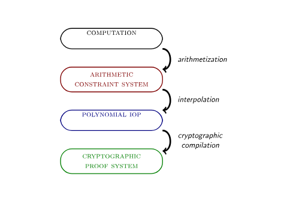

# Introduction

STARKs는 Interactive proof systems 의 한 종류이지만, 지금은 일단 STARKs를 “SNARKs의 특수한 형태”로 생각해봅시다.

STARKs는 다음 5가지 특징을 갖습니다.

1. 해시 함수만 사용하는 암호학적 구조
2. AIR(Algebraic Intermediate Representation)를 이용한 산술화

    - STARKs는 프로그램의 계산 과정을 AIR로 변환(산술화)합니다.
    - 이는 “계산 무결성”을 다항식의 성질(낮은 차수 등)로 표현하는 방식입니다.

3. 계산 무결성을 “저차 다항식” 문제로 귀결

-   결국, “이 프로그램의 계산이 올바르다”는 주장을, “특정 다항식이 낮은 차수를 가진다”는 명제로 바꾸어 증명합니다.
-   이 점이 STARKs가 취하는 핵심 아이디어 중 하나입니다.

4. FRI(Fast Reed-Solomon Interactive Oracle Proof)를 서브프로토콜로 사용

-   다항식이 정말 “낮은 차수(low degree)”임을 입증하기 위해 FRI라는 프로토콜을 씁니다.
-   FRI 자체도 머클 트리를 사용해 증명/검증 과정을 효율적으로 구성합니다.

5. 영지식(Zero-Knowledge) 특성은 옵션

-   전통적인 SNARK는 영지식 특성이 핵심이지만,
-   STARKs는 기본적으로 “계산 무결성(Scalable Transparent ARgument of Knowledge)”에 초점을 맞추며,
-   영지식을 구현할 수도 있지만, 꼭 필수는 아니라는 점이 특징입니다.

# Interactive Proof Systems

## 대화형 증명 시스템(Interactive Proof System)

대화형 증명 시스템(Interactive Proof System)이란?

-   두 당사자, 즉 **증명자(Prover)**와 **검증자(Verifier)**가 서로 질의·응답을 주고받으며,
-   검증자가 어떤 수학적 명제(“claim”)가 참인지 확신하게 만드는 프로토콜입니다.
-   중요한 점은 **“그 명제가 실제로 참일 때만 검증자가 확신한다”**는 것(“soundness”라고 부름)입니다.

예시

-   명제는 이론상 어떤 수학적 주장이든 가능합니다.
-   “Birch and Swinnerton-Dyer 추측이 참이다.”
-   $P \neq NP$
-   “15번째 피보나치 수가 644037이다.”

만약 시스템이 올바르게 작동(sound)한다면, 실제로 거짓인 명제(예: “15번째 피보나치 수 = 644037”)에 대해서는 검증자가 받아들이지 않는다는 의미입니다.

## 암호학적 증명 시스템(cryptographic proof system)

암호학적 증명 시스템이란 대화형 증명(interactive proof)”을 실제 암호학적 환경에서 ‘배포(deployment)’ 가능한 형태로 구체화한 것입니다.

-   수학적 추측이 아닌 구체적인 계산 무결성 문제

    -   이론적인 대화형 증명은 "$P \neq NP$ 인가?” 같은 매우 추상적인 수학 명제를 다룰 수 있습니다.
    -   **하지만 실제 암호학적 증명 시스템(예: SNARK, STARK, etc.)**에서는 “이 특정 프로그램이 입력 $x$에 대해 출력 $y$를 내는 것이 맞는가?”와 같은 계산 무결성(computational integrity)을 검증하는 문제가 대부분입니다.
    -   예: “circuit $C$가 입력 $x$에 대해 결과 $y$를 산출한다”가 참인지 증명.

-   프로토콜 참여자: 증명자(Prover)와 검증자(Verifier)

    -   증명자는 주장을 증명하기 위해 검증자와 대화합니다.일반적으로 대화형 증명에서는 두 당사자가 상호작용하며, 검증자가 여러 메시지를 보낼 수 있고 증명자가 그에 답을 줍니다.
    -   그러나 실제 암호 프로토콜에서는 대부분 “비대화형(non-interactive)” 형태로 만들거나, 아주 제한적인 상호작용만으로도 충분히 검증할 수 있게 만듭니다.
    -   예: 증명자가 한 번의 증명 메시지를 만들어서 검증자에게 전달하고, 검증자는 이 메시지를 가지고 계산해 “참/거짓”을 판단.

-   완전 보안 대신 ‘통계적’ 혹은 ‘계산적’ 보안

    -   이론적으로는 “오류 확률 0”의 완전 보안을 논할 수 있지만, 실무 환경에서는 아주 낮은 확률(“negligibly small”)로 오류가 발생할 수 있는 정도면 충분히 안전하다고 봅니다.
    -   예: 검증자가 극히 작은 확률로 거짓 명제를 참이라고 오판할 수 있지만, 그 확률이 매우 작다면 실용적으로 허용.

-   "모든 컴퓨터 자원이 유한하다"

    -   현실에서, 무한한 계산 능력을 가정할 수 없으므로, 계산량이 제한된(“computationally bounded”) 공격자를 전제하는 계산적(computational) 보안 개념을 도입합니다.
    -   예: 만약 공격자가 무한대의 계산 능력을 가진다면, 현행 암호 시스템 대부분이 깨질 수 있으므로, 실제로는 그런 상황을 상정하지 않는다는 것.

-   검증자가 직접 계산을 재현할 수 없는 이유

    -   자원(리소스) 제약:
        -   만약 검증자가 계산을 재현할 수 있다면, 굳이 복잡한 증명 시스템이 필요 없을 것입니다.
        -   그러나 대규모 계산(예: 복잡한 프로그램 실행, 대량 데이터 처리 등)을 일일이 재현하는 것은 시간·메모리·연산 능력 등에서 부담이 큽니다.
        -   따라서 검증자는 “짧고 간단한 증명”만 확인함으로써, 계산 무결성을 보장받고 싶어합니다.
    -   간결한(Succinct) 증명:
        -   증명이 “짧고 빠르게 검증”될 수 있음을 말합니다.
        -   예: Bulletproofs, Aurora 등은 “증명 크기는 짧지만, 검증자 입장에서 여전히 어느 정도 계산 부담이 있다”는 식으로 언급됩니다.

-   영지식(Zero-Knowledge)이 필요한 경우

    -   비밀 정보 보호:
        -   때로는 계산의 무결성을 증명하면서도, 계산에 쓰인 데이터나 내부 로직을 노출하고 싶지 않을 수 있습니다.
        -   영지식 증명은 “계산 결과가 맞다”는 사실만을 보여주되, 구체적인 내부 정보(예: 입력 데이터)를 노출하지 않습니다.
    -   검증자가 볼 수 없는 정보
        -   검증자에게는 증명자가 가진 일부 자원(데이터, 비밀 등)이 없거나 접근이 불가능합니다.
        -   그래도 검증자는 “그 계산이 옳다”는 점만은 확신하고 싶어 하므로, 영지식 증명으로 무결성을 확인합니다.

-   지식(knowledge) 증명 vs. 단순 무결성 증명
    -   Soundness vs. Knowledge Soundness
        -   “Soundness”는 단순히 “거짓 주장에 대해서 검증자가 낚이지 않는다”는 것.
        -   “Knowledge Soundness(지식 증명)”는 한 단계 더 나아가, “참이라고 증명하려면 실제로 그 비밀(해, 증명하고자 하는 값)을 알고 있어야만 한다”는 성질을 의미합니다.
        -   예: "$x$라는 비밀을 모르는 사람은 절대 이 증명을 완성할 수 없다.”

SNARK는 원래 "Succinct Non-Interactive Argument of Knowledge"의 약자였고, 여기서 **Succinct(간결성)**은 “검증자가 효율적으로 검증할 수 있다”는 의미를 갖습니다. 하지만 최근에는 SNARK라는 용어가 단순히 “증명의 크기가 작다”는 의미로도 쓰이면서, 원래의 초점(검증 효율성)이 다소 희석되고 있습니다.

-   원래 정의:
    -   Succinct = “검증 과정이 매우 빠르고 효율적이다.”
    -   Non-Interactive = “증명자와 검증자가 한 번의 메시지로 증명을 완성할 수 있다.”
    -   Argument of Knowledge = “해당 증명을 만들려면 실제 비밀(해)을 알아야만 한다.”
-   최근 추세:
    -   “Succinct”를 단지 “증명(Proof)의 크기가 작다” 정도로 해석하는 경우가 늘어났다.
    -   즉, 검증 시간은 다소 오래 걸리더라도, 증명 자체가 작으면 “SNARK”라고 부르는 사례가 많아짐.
-   튜토리얼 입장:
    -   이 튜토리얼은 **“원래 정의”**에 충실하게, **“검증자가 빠르게 검증할 수 있다”**는 점이 SNARK에서 중요한 요소라고 본다는 뜻입니다.

# STARK Overview

STARK라는 용어의 뜻

-   Scalable:

    -   두 가지가 동시에 이루어짐

        -   Prover(증명자)의 계산이 “쿼지-선형(quasi-linear)” 정도의 시간 복잡도 안에 가능하다. 즉, 매우 큰 계산이라도 증명 생성이 (입력 크기 대비) 크게 느려지지 않는다.
        -   Verifier(검증자)의 검증은 “다항 로그(polylogarithmic)” 시간에 가능하다. 즉, 계산 크기가 커져도 검증 부담이 느리게 증가한다.

    -   이는 기존의 SNARK에서 Prover가 “매우 무거운(off-line) 계산”을 해도 된다는 점과 대조된다.

-   Transparent:

    -   “신뢰할 수 있는 세팅(trusted setup)”이 필요 없다.
    -   따라서 **크립토그래픽 ‘유독 폐기물(toxic waste)’**이 생기지 않는다.
    -   (전통 SNARKs는 초기 설정에서 비밀 정보를 생성·폐기해야 하는데, STARKs는 그 과정이 없어도 동작)

-   STARK와 SNARK의 관계

    -   STARK를 “인터랙티브한 SNARK의 한 형태”로 볼 수 있지만, 핵심 차이는 “투명성(transparent)”과 “스케일러블(scalable)” 구조다.
    -   즉, 신뢰 설정이 없고 대규모 계산을 효율적으로 처리할 수 있는 SNARK 계열이라고 이해할 수 있음.

-   컴파일 파이프라인(Compilation Pipeline)
    -   STARK 증명을 만드는 과정을 4단계로 나눠서 설명함:
        -   Computation: 원래 수행하려는 계산(프로그램)
        -   Arithmetic Representation: 산술화(AIR, Algebraic Intermediate Representation)로 변환
        -   Polynomial IOP: 다항식 상호작용 증명 프로토콜(Polynomial IOP)로 재구성
        -   Cryptographic Proof System: 최종적으로 암호학적 증명(Proof)을 생성
    -   실제 구현이나 설명 맥락에 따라 단계를 더 세분화할 수도, 합칠 수도 있지만, 튜토리얼에서는 이 4단계로 나누어 설명한다는 뜻.

# Computation

1. 계산(Computation)의 정의

    - 여기서 말하는 “계산”은 일반적인 프로그램(program), 입력(input), 출력(output)의 조합을 말합니다.
    - 예: 어떤 프로그램(알고리즘)이 있고, 특정 입력을 주었을 때, 결과적으로 어떤 출력을 산출하는 과정을 통틀어 “계산”이라고 부릅니다.

2. 머신 친화적 포맷

-   프로그램, 입력, 출력 모두 컴퓨터가 이해할 수 있는 형태(예: 바이트 리스트)로 표현됩니다.
-   이때 프로그램은 “어떤 머신(가상머신)이 메모리나 레지스터 같은 자원을 어떻게 조작할지”를 지시하는 명령어들의 모음입니다.

3. 튜링 완전성(Turing-completeness)

-   일반적으로, 명령어 집합이 충분히 풍부하면 임의의 튜링 머신을 시뮬레이션할 수 있으므로 “튜링 완전”이 됩니다.
-   하지만 이 튜토리얼에서는 프로그램이 “머신 아키텍처에 하드코딩”되어 있어서, 가능한 계산 범위가 제한적일 수 있다고 언급합니다(즉, 실제 예제에서는 완전 범용성을 다루지 않을 수도 있다는 뜻).

4. 계산 자원(Resources)

-   계산을 수행하는 데 필요한 시간, 메모리, 난수(randomness), 비밀 정보(Secret info), 병렬성(parallelism) 등을 “자원”이라 부릅니다.
-   STARK 등의 증명 시스템에서는 이 자원을 많이 사용하는 ‘거대한 계산’을, 검증자 입장에서는 ‘적은 자원’으로 무결성을 검증할 수 있게 만드는 것이 목표입니다.

5. 이론 vs. 실제

-   실제 암호학적 증명에서는 주로 “시간·메모리·난수” 같은 자원을 다루지만,
-   이론적으로는 얽힌 큐비트(entangled qubits), 논-디터미니즘(non-determinism), 거대 오라클(oracle) 등 더 복잡한 자원까지 고려할 수 있습니다.
-   그러나 그런 주제는 계산 복잡도 이론의 영역에 가깝고, 이 튜토리얼에서는 실제 구현(암호학적 실무)에 초점을 맞추겠다는 의미입니다.

# Arithmetization and Arithmetic Constraint System

1. 산술화(Arithmetization)란?

    - 정의: 복잡한 논리 연산이나 기계 명령어들을, 유한체 $F$ 상의 다항식 연산(“산술”)으로 재해석하는 과정입니다.
    - 목적: 프로그램이 “어떤 입력을 주었을 때 어떤 출력을 내는가”를, 궁극적으로는 **“일련의 다항식 방정식”**으로 표현하기 위함입니다.
    - 결과: 프로그램을 실행한 과정 전체가 **“유한체에서 성립해야 할 방정식들의 모음”**으로 바뀌며, 이를 **산술 제약 시스템(Arithmetic Constraint System)**이라 부릅니다.

2. 산술 제약 시스템(Arithmetic Constraint System)

-   본질: (다항식 방정식들) = 0 형태의 식들로 구성됩니다. 각 방정식은 “특정 변수가 특정 연산(덧셈, 곱셈 등)을 거쳤을 때 결과가 어떻게 되어야 하는지”를 규정합니다.
-   통합(Integral): 모든 방정식이 동시에 성립해야 하므로, **하나라도 어기면 전체 시스템이 ‘거짓’**이 됩니다.
-   ‘계산 추적(Execution Trace)’: STARK에서 프로그램의 실행 과정은 레지스터 상태를 담은 튜플들로 표현되며, $state transition function: f:\mathbb{F^r} \to \mathbb{F^r}$ 형태로 “다음 상태(next state)를 어떻게 업데이트하는지”를 정의합니다.
    -   예: 레지스터 4개를 사용한다면, 각 사이클에서 $(r_0, r_1, r_2, r_3)$ 튜플을 업데이트해 나감.

3. 경계 조건(Boundary constraints)와 전이 조건(Transition constraints)

-   경계 조건 (Boundary constraints)

    -   “프로그램 시작 시점에 레지스터가 어떤 값이어야 하고, 끝날 때 어떤 값이어야 하는지”를 규정합니다.
    -   예: “시작할 때 $r_0$는 입력값, 종료할 때 $r_1$ 출력 값.”

-   전이 조건 (Transition constraints)
    -   “인접한 두 상태(튜플) 사이에 어떤 다항식 관계가 있어야 하는가”를 규정합니다.
    -   예: $r_2$는 이전 사이클의 $r_0$과 $r_1$의 곱이어야 한다. 같은 규칙을 유한체 연산으로 표현

이렇게 경계 조건과 전이 조건을 모두 만족하는 전체 상태 열(sequence)이 존재하면, 그 프로그램이 올바른 계산을 수행했다는 것을 의미하게 됩니다.

4. AIR(Algebraic Intermediate Representation)

-   AIR는 “산술화된 중간 표현”이라는 뜻으로, STARK에서 사용하는 형식화된 규칙 집합입니다.
-   프로그램의 로직을 유한체 상의 다항식 제약으로 바꾸는 표준화된 방식이며,
-   STARK 증명은 이 AIR를 기반으로, “해당 다항식 제약을 만족하는 실행 추적이 실제로 존재한다”는 것을 증명·검증합니다.

# Interpolation and RS IOPs

1. 보간(Interpolation)과 다항식으로의 재표현
    - 전통적인 보간:
        - 주어진 점들 $(x_i, y_i)$을 모두 지나는 다항식을 찾는 과정.
        - 예를 들어, $n$개의 점이 주어졌다면, 차수 $n-1$ 이하의 다항식으로 이 점들을 보간할 수 있습니다. 

# Cryptographic Compilation with FRI
