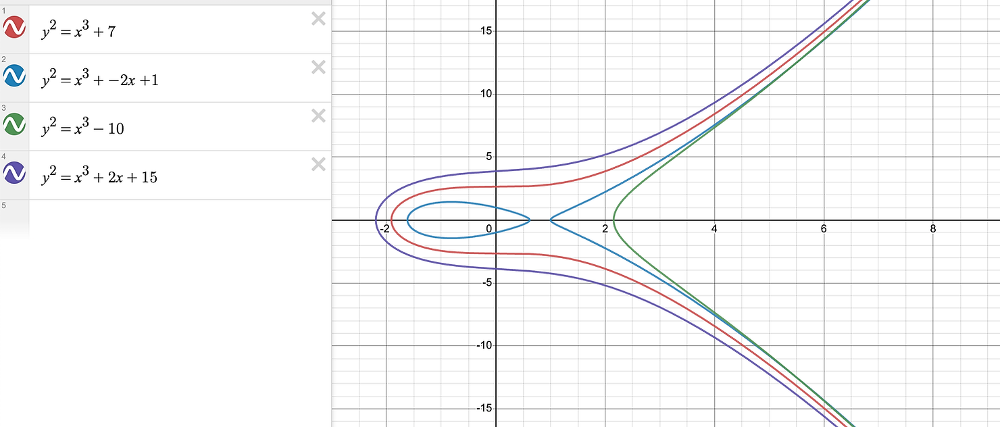
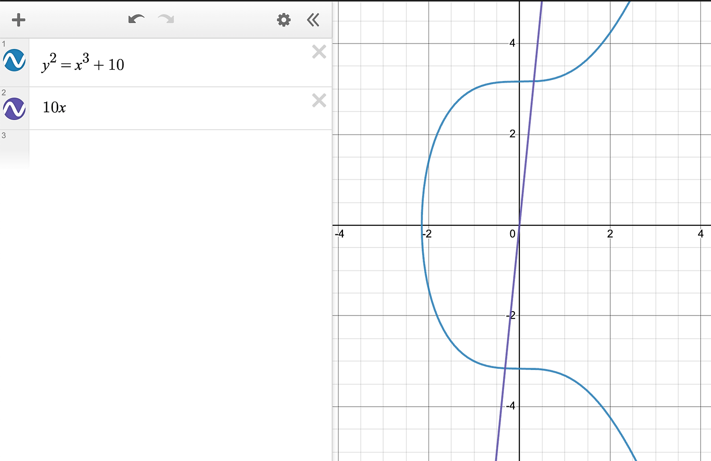
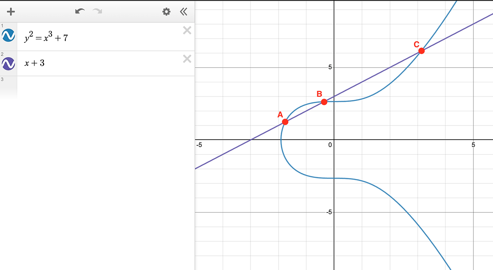
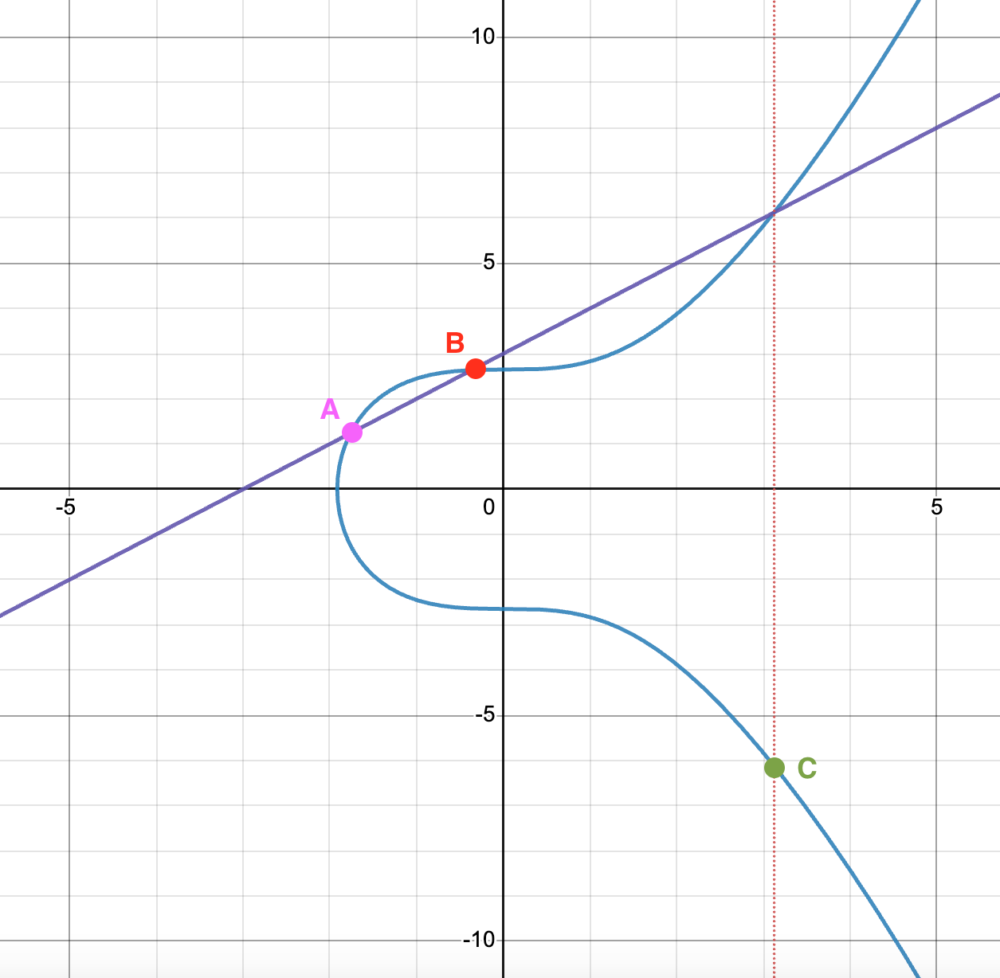
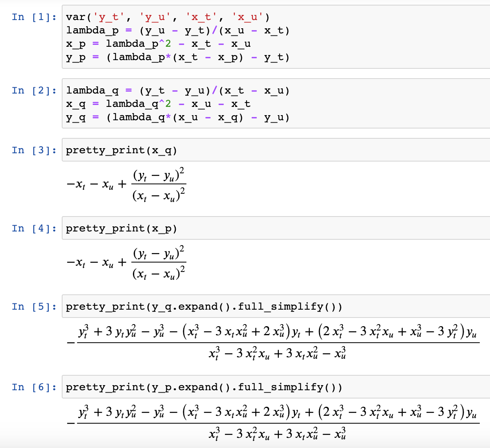
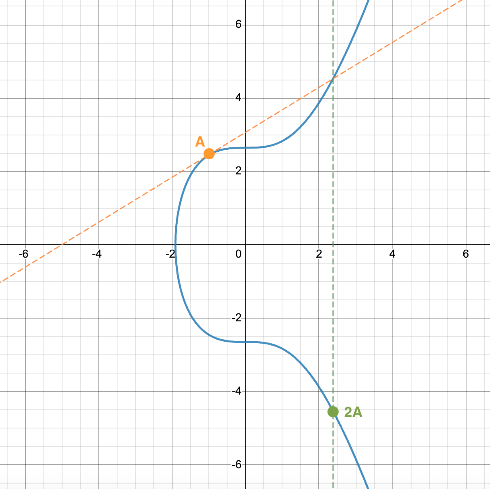

# Introduction

-   타원 곡선(elliptic curve)은 원래 실수(real) 좌표평면 위에서 정의되는 곡선입니다.
-   즉, 우리가 일반적인 수학 그래프(2차원 좌표평면)에 그려서 직관적으로 ‘타원 곡선’ 모양을 살펴볼 수 있죠.
-   그러나 실제 암호학에서는 이 ‘타원 곡선’을 유한체(finite field) 위에서 정의합니다.
-   하지만 여기서는 이해의 편의를 위해 실수 좌표평면에서 다뤄보도록 합니다.

# Set theoretic definition of elliptic curves

1. **“타원 곡선 위의 점들의 집합이 군을 이룬다”**

    - 여기서 ‘군(group)’이란 대수 구조로서, 어떤 집합과 그 위에서 정의된 연산이 닫힘, 결합 법칙·항등원·역원을 만족하는 체계를 말합니다.
    - 타원 곡선(Elliptic Curve) 위에서는 ‘점 덧셈(point addition)’이라는 특수한 연산을 정의할 수 있고, 이 연산으로 인해 타원 곡선의 모든 점들이 군 구조를 형성하게 됩니다.

2. **“점 덧셈(point addition)”**

    - 이것은 타원 곡선 상의 임의의 두 점을 이용해 세 번째 점을 ‘덧셈’ 결과로 정의하는 연산입니다.
    - 구체적으로는 기하학적 해석을 통해 두 점을 잇는 직선(또는 접선)이 타원 곡선을 다시 교차하는 지점을 찾아, 그 점을 ‘반사’해 얻는 방식으로 계산됩니다.
    - 엄밀히 알지 않아도 “이러한 연산을 통해 군이 된다”라는 사실을 추상적으로 이해할 수 있다는 뜻입니다.

3. **추상대수의 관점**

    - 문장에서 “그게 추상대수의 아름다움”이라는 표현이 나옵니다. 즉, 점 덧셈이 정확히 어떻게 계산되는지 세세히 몰라도, 이 구조가 군을 이루고 있다는 점만 알아도 큰 그림을 파악할 수 있다는 이야기입니다.
    - 그룹 이론의 기초 개념(결합법칙, 항등원, 역원 등)을 알고 있으면, “타원 곡선 위의 점들은 특정 연산으로 군을 이룰 수 있다”라는 문장을 쉽게 받아들일 수 있다는 의미입니다.

4. **“Elliptic curves are a family of curves which have the formula y² = x³ + ax + b.”**
    - 타원 곡선은 위 식 형태(큐브항이 포함된 3차 방정식)를 가지는 곡선들을 가리킵니다.
    - 주어진 식에서 파라미터 a, b가 타원 곡선을 구체적으로 정의하고, 이 곡선 위에서 위에서 말한 점 덧셈을 수행할 수 있게 됩니다.

**타원 곡선 위의 점**들을 단순히 “2차원 그래프 위에 그려진 곡선”으로 보는 대신,  
“특정 방정식(예: $y^2 = x^3 + ax + b$을 만족하는 $(x, y)$ 쌍들의 **집합**)”으로 생각해봅시다.

# Elliptic Curves form an abelian group under addition

여기서의 핵심은 **타원 곡선 위의 점들이 어떤 이항 연산(여기서는 “⊕”로 표현됨)을 통해 군(Group) 구조를 형성한다**는 것입니다.
구체적으로는 다음과 같은 내용을 담고 있습니다:

1. **닫힘(Closure)**

    - 두 점 $P, Q$가 모두 타원 곡선 위에 있으면, $P \oplus Q$ 역시 같은 타원 곡선 위의 점이 됩니다.
    - 즉, 이 연산을 해도 집합(타원 곡선 위의 점들)을 벗어나지 않는다는 의미입니다.

2. **결합법칙(Associativity) & 교환법칙(Commutativity)**

    - 결합법칙: $(A \oplus B) \oplus C \;=\; A \oplus (B \oplus C)$
    - 교환법칙(아벨군이라고 했으므로): $A \oplus B \;=\; B \oplus A$
    - 즉, 점 셋을 어떤 순서로 연산해도 결과가 동일하며, 두 점의 위치를 바꿔도 결과가 같습니다.

3. **항등원(Identity Element)의 존재**

    - 어느 점 $P$가 있더라도, $P$와 항등원 $I$(Identity)을 연산하면 결과가 $P$ 그대로 남습니다.
    - 타원 곡선 군에서 이 항등원은 “무한원점(Point at infinity)” 같은 개념으로 해석됩니다.

4. **역원(Inverse)의 존재**

    - 모든 점 $P$마다 그에 대응하는 역원 $P^{-1}$이 존재하여,
      $P \oplus P^{-1} = I$ ($I$ is identity element)

5. **이항 연산의 구체적 계산 방식은 몰라도 된다**
    - 이 글에서 강조하는 점은 “연산(⊕)이 어떻게 정의되는지 상세히 모르더라도, 군의 성질을 만족한다는 사실만 알면 된다”는 것입니다.
    - 구체적인 점 덧셈(point addition) 공식은 비교적 복잡하지만, 중요한 건 이 연산으로 인해 군이 형성된다는 추상적인 이해입니다.

## The identity element

-   **타원 곡선 군에서의 항등원(Identity Element) 개념**을 다뤄보겠습니다.
-   통상적으로 군에서 항등원은 $e$나 $I$ 또는 $\mathcal{O}$로 부르며, 어떤 원소 $x$가 있어도 $x \oplus \mathcal{O} = x$가 성립하는 특별한 원소입니다.

1. **일반적인 좌표 $(0,0)$, $(1,1)$ 같은 점이 아니라 ‘무한원점(Point at Infinity)’을 사용**

    - $y^2 = x^3 + ax + b$ 위에 있는 실제 좌표들 중에서 “항등원” 역할을 하는 점을 찾기는 불가능한 경우가 많습니다.
    - 예컨대 $(0,0)$이 항상 곡선 위에 존재하는 것은 아니므로, 임의로 골라 쓸 수 없습니다.
    - 따라서 **군 구조**를 완성하기 위해, 곡선 위에 존재하지 않는 ‘특수한 점’을 추가하는데, 이를 **무한원점**(point at infinity)이라고 부릅니다.

2. **무한원점은 “아무 데도 없는 점”**

    - 말 그대로, 2차원 좌표계 상에 존재하지 않는 추가 원소입니다.
    - 이 점을 항등원으로 정의하면, 곡선 위 임의의 점 $P$에 대해 $P \oplus \mathcal{O} = P$가 성립합니다. ($\mathcal{O}$는 무한대 점)

3. **집합을 확장해 군을 정의**

    - 원래 군을 이루는 대상은 $y^2 = x^3 + ax + b$를 만족하는 실수 좌표들의 집합입니다.
    - 하지만 항등원을 포함시키려면 이 무한대 점 $\mathcal{O}$를 추가해야 하므로, **집합을 “곡선 위 점 + 무한원점”** 형태로 확장합니다.

4. **“무한원점이 식을 만족해야 하는가?”**
    - 본문에서 지적하듯, $y^2 = x^3 + ax + b$로는 무한원점을 나타낼 수 없습니다.
    - 그러나 “집합과 이항 연산은 우리가 임의로 정의할 수 있다”는 집합론적 관점에 따라,
    - “무한원점”이라는 원소를 새로 추가하고, 그것이 항등원 역할을 하도록 연산 규칙을 부여함으로써 군 공리(결합법칙, 항등원, 역원 등)를 만족하게 만들 수 있습니다.

# Addition is closed

이제 **타원 곡선의 군 연산(‘점 덧셈’)이 어떤 기하학적 성질을 가지는지** 다뤄보겠습니다.

1. **직선과 타원 곡선의 교차는 세 점을 이룬다**

    - $y = 10x$처럼 완벽하게 수직이 아닌 직선이 타원 곡선 $y^2 = x^3 + 10$과 만날 때,  
      일반적으로는 교차점이 최대 3개가 됩니다(중복 교차 포함).
    - 기하학적으로나 대수학적으로, 3차 방정식을 직선과 함께 풀면 해가 최대 3개가 나오는 것과 같은 원리입니다.
    - 만약 직선이 타원 곡선에 두 점만 교차한다면, 그 직선이 **수직선**이거나(교차점이 “무한원점”과 연관)  
      또는 두 점 중 하나가 탄젠트(tangent; 접선) 교차(동일한 점에서의 중복 교점)여서 사실상 ‘중복 근’을 형성하는 경우입니다.

2. **완벽하게 수직인 선의 특수성**

    - 만약 $x$좌표가 고정된 ‘수직선’이라면, 보통은 곡선과 최대 2점에서 교차합니다.
    - 하지만 이때 **‘무한원점(Point at infinity)’** 개념이 등장해, 군 연산상 세 번째 교차를 보완한다고 해석할 수 있습니다.
    - 이 특수 케이스가 타원 곡선에서 역원(inverse)와 항등원(identity)을 시각적으로 설명할 때 중요한 역할을 합니다.

3. **역원은 $y$좌표를 반전한 점**

    - 타원 곡선에서 점 $(x, y)$의 역원은 $(x, -y)$입니다.
    - 직관적으로, 이를 잇는 직선(두 점을 잇는 선)은 ‘수직선’이 되므로, 이 경우에 세 번째 교차점이 바로 **무한원점**이 됩니다.
    - 따라서 군 연산에서 $P \oplus P^{-1} = \mathcal{O}$(무한원점)이라는 관계가 기하학적으로도 드러납니다.

## Abelian Group

왜 **타원 곡선 위 점들의 군이 “아벨 군(Abelian Group)”** 인지 다뤄보겠습니다.
이는 점 $A$와 점 $B$를 덧셈 연산($\oplus$)으로 합쳤을 때 $A \oplus B = B \oplus A$라는 **교환법칙**이 성립한다는 뜻입니다.

-   “두 점이 만나면 세 번째 점이 생긴다”는 타원 곡선 점 덧셈의 기하학적 특성 덕분에,  
    서로 다른 해가 여러 개 나올 수 없는 구조이므로,  
    연산 순서를 바꿔도 동일한 결과 $(A \oplus B)$가 나온다는 점이 직관적으로 명확해집니다.

-   “2점이 만나면 반드시 유일한 세 번째 점을 결정하고, 그 이외에 추가 교차가 더 생기지 않는다.”  
    이 말은 기하학적으로 교환법칙을 시각적으로 뒷받침해줍니다.  
    왜냐하면 $A \oplus B$나 $B \oplus A$나 결국 같은 직선을 이용해 교차점을 찾기 때문입니다.

-   결론적으로, **교환법칙**을 가지는 군을 “아벨 군(Abelian Group)”이라고 부르며,  
    타원 곡선 위 점 덧셈 군이 바로 이 아벨 군의 예가 됩니다.

# Why elliptic curve addition flips over the x axis

이제 “왜 타원 곡선 덧셈에서 ‘세 번째 교점’을 그대로 쓰지 않고, x축에 대해 반사(reflection)한 점을 최종 덧셈 결과로 정의해야 하는가?”를 다뤄보겠습니다.

1. **문제 상황**

    - 그림에서 보듯이, 점 $A$와 $B$를 잇는 직선이 곡선과 교차하는 세 번째 점이 $C$라고 가정했을 때,
    - 단순히 $A \oplus B = C$로만 정의하면 군의 연산 규칙상 모순이 발생합니다.
    - 예를 들어, $A \oplus B = C, A \oplus C = B, B \oplus C = A$ 같은 조건들이 충돌을 일으켜  
      특정 점($B$)이 자기 자신과 역원이 되어버리는 불가능한 상황이 됩니다.
    - $(B \oplus C) \oplus B = C$ 여기서 양변에 $inv(B)$ 를 더해줍니다.
    - $(B \oplus C) \oplus B \oplus inv(B) = inv(B) \oplus C$ 그러면 $B \oplus inv(B) = \mathcal{O}$ 이므로, 아래와 같이 나타낼 수 있습니다.
    - $B \oplus C = inv(B) \oplus C$ 여기서 양변에서 $C$ 를 제외하면,
    - $B = inv(B)$ 이 되는데, 이는 모순이 됩니다.

2. **해결책: x축 반사**

    - 실제로는 **“세 번째 교점”을 찾은 뒤, 그 점을 **x축에 대해 뒤집은 점**을 ‘덧셈 결과’로 정의**해야 합니다.  
      즉, $A \oplus B$는 “직선이 만들어내는 세 번째 교점 $C$의 x좌표는 같지만, $y$좌표의 부호만 반대인 점”이 됩니다.
    - 이렇게 해야만 군 공리(특히 역원, 항등원)와 합리적 호환이 이루어집니다.

3. **직관적 이해**

    - 기하학적으로, 곡선 위 두 점을 잇는 선이 곡선과 만나는 **실질적 교점**을 먼저 찾은 다음,
    - 그 교점을 x축에 대해서 **위아래 반사**시킨 점을 “덧셈의 결과”로 삼으면,
    - 역원, 항등원, 교환법칙 등 타원 곡선 군의 성질이 모두 성립합니다.

4. **결론**
    - “타원 곡선 덧셈(점 덧셈)”을 제대로 정의하려면 “직선 교점 + x축 반사” 과정을 꼭 거쳐야 합니다.
    - 만약 x축 반사를 생략하고 세 번째 교점을 그대로 더한 결과로 삼으면, 군 구조가 깨져서 모순이 발생하게 됩니다.

# Formula for Addition

#### 두 직선을 이어 다른 교점을 찾기

-   $y^2 = x^3 + ax + b$ 꼴의 타원곡선에서,
-   두 점 $P$와 $Q$를 잇는 직선의 방정식은 $y=λx+c$ 꼴로 표현할 수 있습니다.
-   그리고 이 직선이 타원곡선과 만나는 점 $R = (x_3, y_3)$도 존재합니다.
-   세번째 교점을 찾기 위해 직선을 타원곡선의 식에 대입하면,
-   $(λx+c)^2 = x^3 + ax + b$
-   이 식을 정리하면, $x^3 - λ^2x^2 + (\dots)x + (\dots) = 0$ 꼴의 3차 방정식이 됩니다.
-   이 방정식의 해 중 하나가 $x_3$이 되고, 이를 통해 $y_3$ 값도 계산할 수 있습니다.
-   여기서 Vieta의 공식을 적용합니다.
-   비에트 정리는 근과 계수의 관계를 다루는데, $ax^3 + bx^2 + cx + d = 0$에서 세 근을 $x_1, x_2, x_3$라고 할 때,
-   세 근의 합은 $x_1 + x_2 + x_3 = -\frac{b}{a}$ 가 됩니다. (증명 생략)
-   이 식을 통해 $x_3$ 값을 찾을 수 있습니다.
-   다시 돌아가서, $x^3 - λ^2x^2 + (\dots)x + (\dots) = 0$ 의 다항식에서 비에트 정리를 이용하면,
-   $x_1 + x_2 + x_3 = λ^2$ 이 됩니다.
-   여기서 우리는 $x_3 = λ^2 - x_1 - x_2$ 가 됨을 알 수 있습니다.

#### 교점을 뒤집기

-   이제 세번째 점 $R$의 x좌표를 찾았으니, 이제 y좌표를 찾고 다시 이 점을 뒤집어 원래 타원곡선 위에 놓아봅시다.
-   이 점의 좌표는 $(x_3, -y_3)$ 가 됩니다.
-   다시, 직선의 기울기로 돌아가서 기울기 $λ$는 직선 위의 임의의 두 점$(x_{1}, y_{1})$, $(x, y)$에 대해,
-   $λ = \frac{y-y_1}{x-x_1}$ 로 정의됩니다.
-   위의 식을 변형하면, $y - y_1 = λ(x-x_1)$ 이 됩니다.
-   이제, $R = (x_3, y_R)$가 직선 위의 점이므로, $x = x_3, y = y_R$ 을 대입하면,
-   $y_R - y_1 = λ(x_3 - x_1)$ 이 됩니다.
-   이제 이를 x축에 대해 반사시킨 점이 $P + Q$ 가 됩니다.
-   $y_3 = -y_R$ 이므로, $y_3 = -[λ(x_3 - x_1) - y_1]$ 이 됩니다.
-   이를 보기 좋게 재배열하면, $y_3 = λ(x_1 - x_3) - y_1$ 이 됩니다.
-   결국 직선 대입 → 교점 R 구하기 → x축 반사”라는 타원곡선 덧셈의 기하학적 과정을 가장 간단히 나타낸 것이 바로 위의 식입니다.

## Algebraically demonstrating commutativity and associativity

$P = T \oplus U$ 이고, $Q = U \oplus T$ 라고 합시다. 이 때, $P = Q$ 인지 보겠습니다.

두 점 $(x\_{t}, y\_{t})$와 $(x\_{u}, y\_{u})$에서 덧셈이 교환법칙을 만족하는지 보겠습니다.
이 두 점을 잇는 직선의 기울기는 다음과 같습니다.

$\lambda_{p} = \frac{y_u - y_t}{x_u - x_t}$

위에서 살펴본 덧셈 공식에 따라 아래와 같이 $p$ 좌표를 구할 수 있습니다.

-   $x_{p} = \lambda_{p}^2 - x_{t} - x_{u}$
-   $y_{p} = \lambda_{p}(x_{t} - x_{p}) - y_{t}$

이제 $Q$ 의 좌표를 구해보겠습니다.

$\lambda_{q} = \frac{y_t - y_u}{x_t - x_u}$

-   $x_{q} = \lambda_{q}^2 - x_{u} - x_{t}$
-   $y_{q} = \lambda_{q}(x_{u} - x_{q}) - y_{u}$

이 두가지가 동일한지를 풀어서 보면 아래 그림과 같습니다.

-   결합법칙의 경우 증명이 복잡하므로, 여기서는 생략하겠습니다.

# Elliptic curves meet the abelian group property

다시 정리를 해보겠습니다. 타원곡선은 아벨군의 특성을 만족합니다.

1. **닫힘(Closure)**

    - 타원 곡선 위 두 점을 이항 연산으로 결합하면, 그 결과도 여전히 곡선 위의 유효한 점(혹은 무한원점)입니다.

2. **항등원(Identity Element)**

    - 무한원점(Point at Infinity)을 항등원으로 설정하여, 어떤 점 $P$에 대해 $P \oplus \mathcal{O} = P$가 성립합니다.

3. **역원(Inverse)의 존재**

    - 각 점 $P = (x, y)$마다 역원 $-P = (x, -y)$가 존재해, $P \oplus (-P) = \mathcal{O}$가 됩니다.

4. **결합법칙(Associativity)**

    - 타원 곡선 위 세 점 $A, B, C$에 대해, $(A \oplus B) \oplus C = A \oplus (B \oplus C)$가 성립합니다.

5. **아벨 군(Abelian Group)**
    - 교환법칙 $A \oplus B = B \oplus A$가 성립하므로, 군이면서도 순서에 구애받지 않는 아벨 군이 됩니다.

# Point multiplication: adding a point with itself

“점 덧셈”에서 **두 점이 같을 때**(예: $A$와 $A$를 더할 때),  
이를 “점 배가(Point Doubling)”라고 합니다. 수학적으로는 $A \oplus A = 2A$로 표기합니다.

1. **기하학적 해석**

    - $A$와 $A$가 ‘무한히 가깝다’고 생각하고 두 점을 잇는 직선을 그리면, 이 직선은 곡선에 **접선(tangent)**이 됩니다.
    - 이 접선이 타원 곡선과 만나는 또 다른 교점을 찾고, 그 점을 $x$축에 대해 반사하면 결과가 $2A$가 됩니다.

2. **$2A$의 의미**
    - 군 연산에서 $2A$는 $A$를 두 번 더했다라는 뜻이며, 그 결과 역시 타원 곡선 위의 점이 됩니다.
    - 이것을 확장해 $nA$ (스칼라 곱셈)도 정의할 수 있습니다: $nA = A \oplus A \oplus \dots \oplus A$ ($n$번).

## Shortcut for point multiplication

이제 **타원 곡선 상에서 점에 대해 큰 정수를 곱하는 연산**(점 스칼라 곱셈)을 어떻게 효율적으로 계산할 수 있는지 다뤄보겠습니다.

1. **문제 제기**

    - 단순하게 $1000A$를 구할 때,  
      $A$를 1000번 덧셈해서 $(A \oplus A \oplus \dots \oplus A)$를 구하면  
      연산이 $\mathcal{O}(n)$에 해당합니다($n=1000$).

2. **이진 분할법(Exponential / Double-and-Add)**

    - “점 배가(Doubling)”과 “점 덧셈(Addition)”을 합쳐서,  
      큰 스칼라 곱을 이진 분할 방식으로 빠르게 계산할 수 있습니다.
    - 예를 들어 $1000A$는

        $1000 = 512 + 256 + 128 + 64 + 32 + 8$

        이므로,  
         $1000A = 512A \oplus 256A \oplus 128A \oplus 64A \oplus 32A \oplus 8A$

    - $512A$는 $A$를 9번 점 배가(doubling)한 결과로 구할 수 있고,  
      $256A$, $128A$, $64A$ 등도 마찬가지 방식(반복 배가)으로 쉽게 얻습니다.
    - 그 뒤, 이렇게 구한 중간 결과들을 점 덧셈으로 합치면 됩니다.

3. **복잡도 개선**

    - $1000A$를 직접 1000번 더하는 대신,  
      **점 배가 9번(512A까지)** + **덧셈 5번** = 총 **14번** 정도의 연산만으로 가능하게 됩니다.
    - 일반적으로 $n$비트짜리 정수 $k$에 대해  
      **$\mathcal{O}(\log n)$ 수준**의 점 덧셈/배가 연산으로 $kA$를 구할 수 있습니다.

# Implementation details of addition

**타원 곡선을 ‘군’으로 이해하는 관점**이 직접 방정식을 풀며 모든 세부 기호를 따라가는 것보다 훨씬 쉽습니다.

1. **점 덧셈 공식 자체는 어렵지 않다**

    - 두 점을 잇는 직선의 기울기(슬로프)를 구하고,
    - 교차하는 세 번째 점을 찾은 후, x축에 대해 뒤집는 과정을 대수적으로 풀면,
    - 점 덧셈 공식이 자연스럽게 유도됩니다.

2. **하지만 군 이론 측면에서 보면**

    - 구체적으로 기호를 다루지 않아도,
    - “타원 곡선 위의 점들과 그 사이의 이항 연산이 군의 성질을 만족한다”는 사실만 이해하면 됩니다.
    - 군에 대한 기본 개념(폐쇄성, 결합법칙, 항등원, 역원, 교환법칙)을 알면,  
      타원 곡선을 그저 “이 연산을 갖는 하나의 군”으로 볼 수 있습니다.

3. **다른 Algebraic group들과의 유사성**

    - 예: 유리수의 덧셈, 소수 정수 모듈로 곱셈, 행렬 곱셈 등
    - 이런 익숙한 군들을 먼저 학습한 다음,  
      그 직관을 “타원 곡선 군”으로 옮겨오면 훨씬 쉽게 이해할 수 있습니다.

## Algebraic manipulation is really just associative addition.

여기서는 타원 곡선 점에 대한 “스칼라 곱셈”이 사실은 **점 덧셈의 반복**이라는 점을 강조하고 있습니다.

1. **스칼라 “곱셈” vs. 실제 덧셈**

    - $aP$라는 표현은 “점 $P$를 $a$번 더한다”는 것을 간단히 쓴 기호입니다.
    - $(a + b)P = aP + bP$ 같은 관계는 실제로 $P$를 여러 번 더하는 과정을 ‘곱셈처럼’ 표현한 것이지,  
      일반적인 수 체계에서 말하는 곱셈의 분배법칙(예: $a(b + c) = ab + ac$)과는 맥락이 조금 다릅니다.

2. **결합법칙(Associativity)에 의한 재배열**

    - 덧셈($\oplus$)이 결합법칙을 가지므로, $aP \oplus bP \oplus cP$를 어떻게 묶어 계산해도 결과가 같습니다.
    - 그러다 보니 $(a + b + c)P$ 같은 표기로 쓰면 마치 한 번에 곱셈을 한 것 같지만,  
      실제 계산 과정은 $P$를 $(a + b + c)$번 반복해서 더하는 것입니다.

3. **스칼라 곱셈이 곱셈 연산을 뜻하는 건 아니다**
    - 말 그대로$n$배라서 “곱셈” 기호를 쓰긴 하지만,
    - **이 군에서는 ‘덧셈’만 정의되어 있고, ‘곱셈’이란 별도의 이항 연산이 존재하지 않습니다.**
    - $n \cdot P$는 은유적/편의적 표기일 뿐이라는 의미입니다.

# Elliptic curves in finite fields

여기서는 “타원 곡선을 실제로 활용할 때는 실수(real) 대신 유한체(finite field) 위에서 정의된 형태로 사용한다”는 것을 설명하고 있습니다.

1. **실수 좌표계(Real)에서의 문제점**

    - 만약 실제 애플리케이션에서 $y^2 = x^3 + ax + b$를 실수 연산으로 다룬다면,  
      소수점 계산이나 부동소수점 오류 등으로 인해 **수치적으로 불안정**해질 수 있습니다.
    - 예를 들어, 곡선과 직선이 교차하는 지점을 찾으려면 매우 정밀한 소수 연산이 필요할 수 있고,  
      부동소수점 반올림 오차 때문에 정확한 계산이 어렵습니다.

2. **유한체(모듈로 연산)로의 전환**

    - 실제 **타원 곡선 암호**에서는 보통 소수 $p$에 대해 $\mathbb{F}_p$ 같은 **유한체** 위에서  
      $y^2 \equiv x^3 + ax + b \pmod{p}$ 형태로 정의합니다.
    - 이때 모든 연산(덧셈, 뺄셈, 곱셈, 나눗셈)은 모듈로 $p$로 이루어지므로,  
      **정밀도 문제** 없이 “정수 연산”만으로 안전하게 계산할 수 있습니다.

3. **직관은 그대로 유지**
    - “유한체 위의 타원 곡선”이라고 해도,  
      우리가 “실수 평면 위의 타원 곡선”에서 배운 기하학적 직관(두 점을 잇는 직선, 세 번째 교점, x축 반사 등)이  
      개념적으로 그대로 적용됩니다.
    - 다만 실제 계산은 정수 모듈로 연산으로 진행되며,  
      이는 **암호학적으로 매우 안정적**이고 구현이 간단하다는 장점이 있습니다.

결국, **실수 대신 유한체(모듈로 연산)를 사용해도 타원 곡선이 갖는 군(Abelian group) 구조와 기하학적 직관은 잃지 않으면서,  
수치적 안정성과 보안성을 확보**할 수 있다는 뜻입니다.
