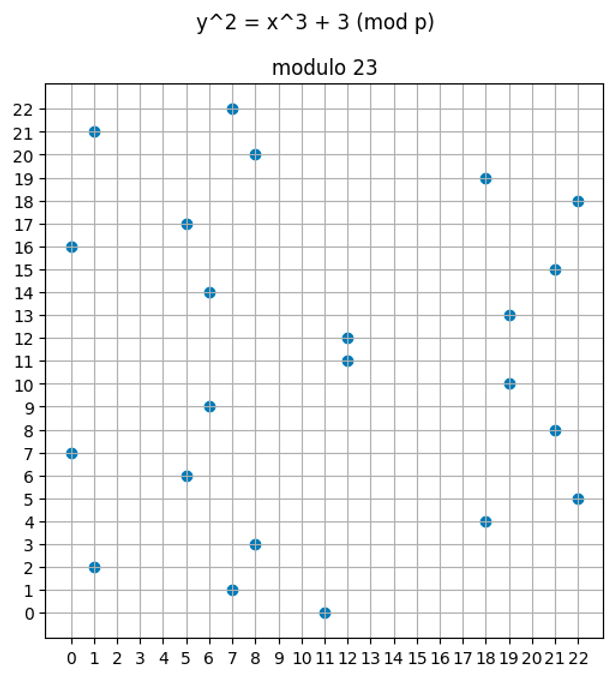
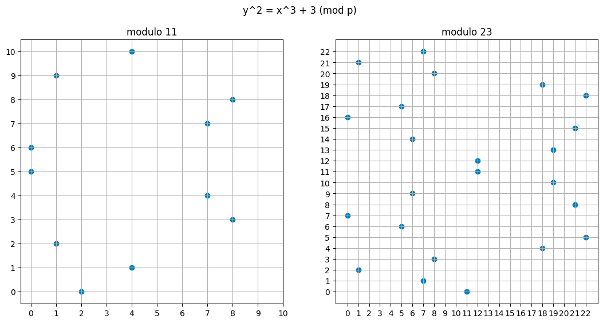
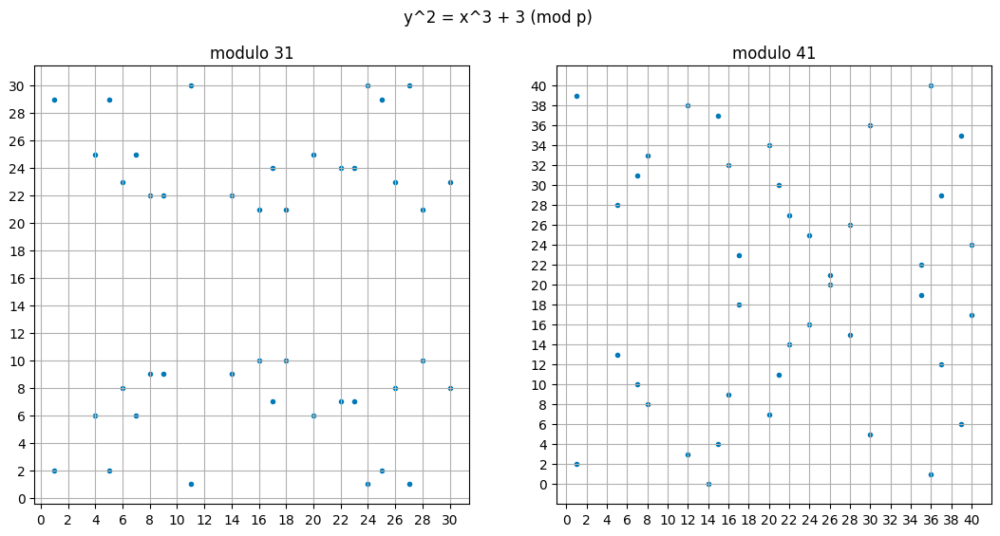
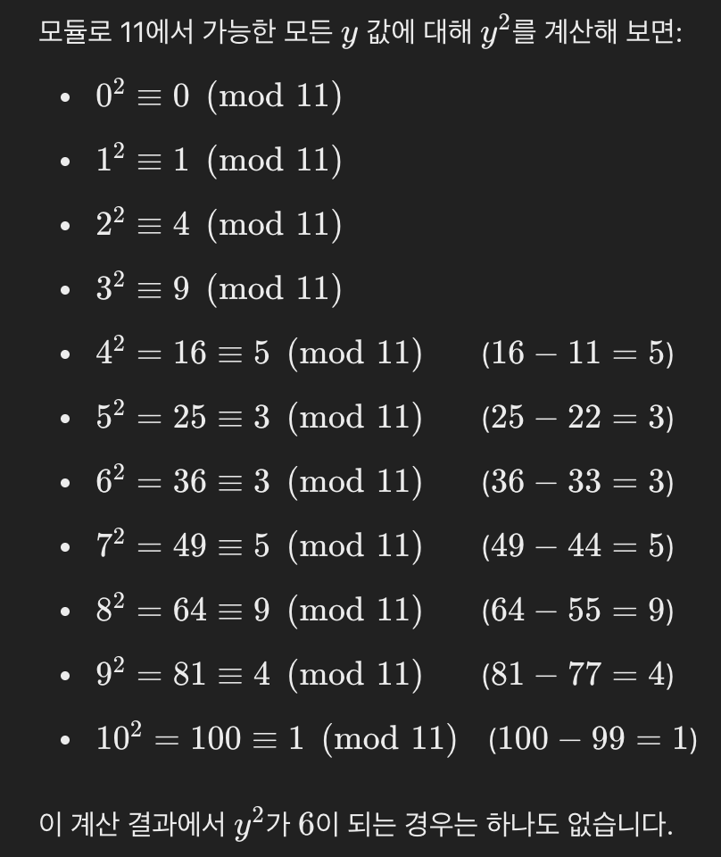
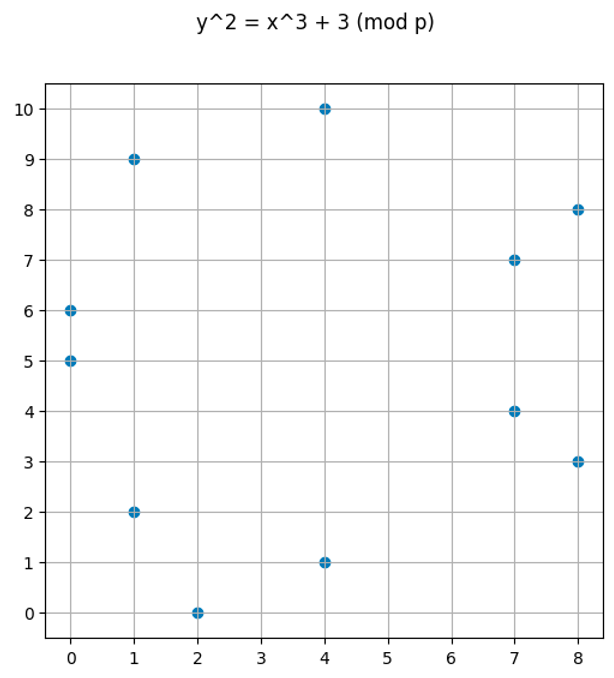
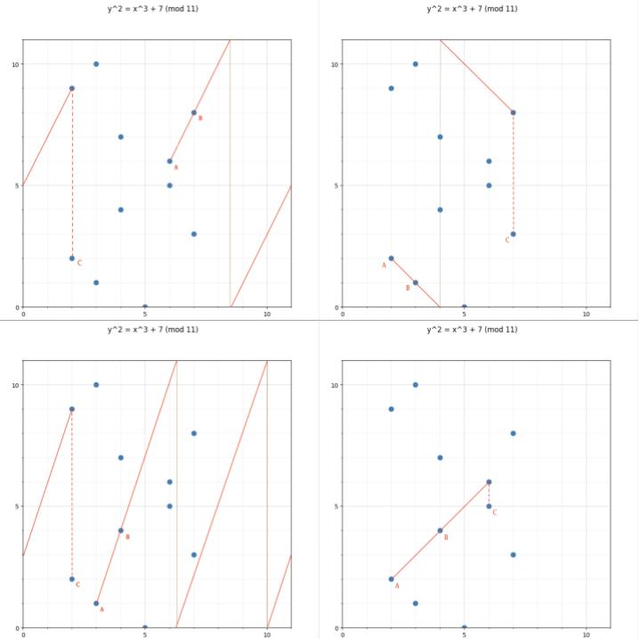
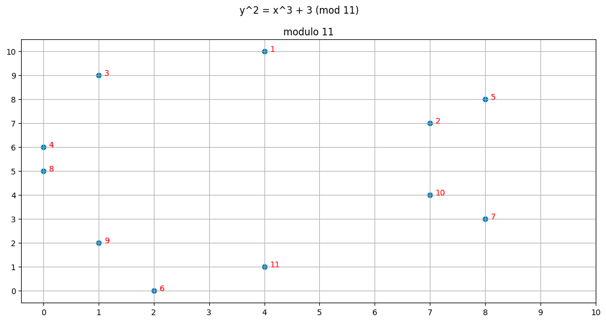
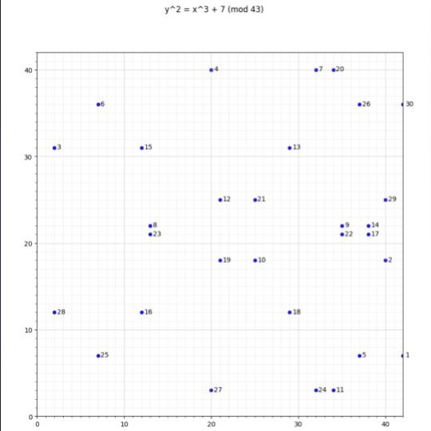
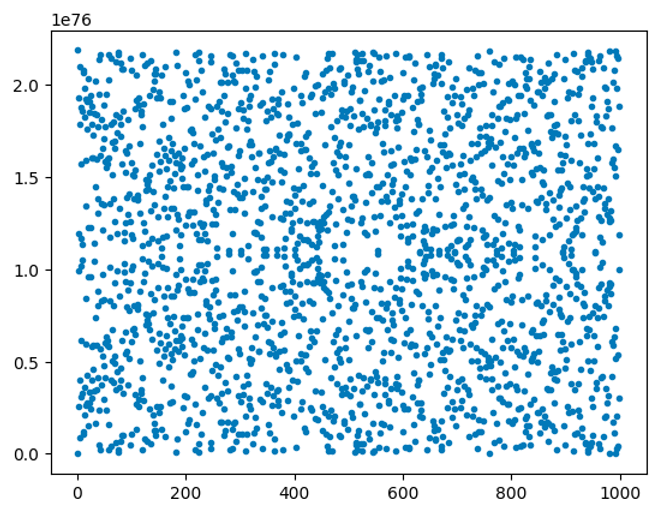

# Introduction

$$
y^2 = x^3 + ax + b
$$

-   실수체(Real Numbers)에서는 타원곡선이 부드러운 곡선으로 보입니다
-   하지만 유한체에서는 원소가 유한하고 이산적이어서, 곡선이 아니라 점들로만 나타납니다.



유한체 $\mathbb{F}\_p$ (예를 들어, $p$가 소수일 때)에서는 $x$와 $y$의 값이 다음과 같이 제한됩니다.

$$
x,\, y \in \{0, 1, 2, \dots, p-1\}
$$

모든 연산은 $\mod p$에서 수행됩니다. 즉, 타원곡선의 식은

$$
y^2 \equiv x^3 + ax + b \pmod{p}
$$

와 같이 표현됩니다.

Q) 어떻게 주어진 $x$에 대한 $y$의 해가 존재하는지 알 수 있는가?

Q) 왜 그래프에서 y의 해는 최대 2개만 존재하는가?

-   이차잔기(Quadratic residue) 개념
-   이차잔기 판별법 (르장드르 기호)
-

## The prime number changes the plot dramatically




-   modulus가 클수록 점이 더 많아지고, 그래프도 더 복잡해짐을 알 수 있음
-   유한체상에서 타원곡선을 정의하면, 군(Group)이 되고, 나아가 순환군(Cyclic Group)이 됨
-   순환군이 되는 이유는 수학적으로 증명하기가 복잡하기 때문에 여기서 다루지는 않지만, 아래와 같이 직관적으로 이해할 수 있음

$$
(x+1)G, (x+2)G, (x+3)G, \dots, (x+order-1)G
$$

-   여기서 $x$는 단순히 정수 인덱스를 의미하는 용도로 사용됨, 즉 위 식은 아래와 같이 표현할수도 있음

$$
G, 2G, 3G, \dots, (order-1)G
$$

-   실제로 타원곡선을 사용할 때는, 소수 $p$ 값을 매우 크게 설정함

# Background

## Field element

### 1. 유한체에서의 원소(Field Element)에 대한 설명

-   예를 들어, 모듈로 11에서의 유한체는 $\mathbb{F}_{11}$는 $\{0, 1, 2, \dots, 10\}$ 이렇게 표현할 수 있음
-   Field Element는 이 유한체에 속하는 원소를 의미함

### 2. 음수(Negative) 개념과 동치

유한체에서 “-1”이나 “-4” 같은 음수는 사실상 어떤 양의 정수와 동치로 표현됩니다.

-   예를 들어, $\mathbb{F}_{11}$에서 $-1 \equiv 10 \pmod{11}$ 이고, $-4 \equiv 7 \pmod{11}$ 입니다.
-   왜냐하면, $1+10=11$ and $11 \equiv 0 \pmod{11}$이고, $4+7=11$ and $11 \equiv 0 \pmod{11}$이기 때문입니다.
-   그래서 “유한체에는 음수가 없다”라고 할 때는, 최종적으로 $\{0, 1, 2, \dots, p-1\}$ 형태로 대표 원소를 선택해 쓰기 때문입니다.

### 3. 덧셈과 항등원, 역원

-   덧셈 항등원은 0입니다. 즉, $a + 0 \equiv a \pmod{p}$ 입니다.
-   덧셈에 대한 역원은 어떤 수를 더했을 때 항등원 즉, 0이 되는 원소를 의미합니다.
-   예: 즉, 4의 덧셈 역원은 7입니다. 왜냐하면, $4 + 7 = 11 \equiv 0 \pmod{11}$ 이기 때문입니다.

### 4. 곱셈과 항등원, 역원

-   곱셈 항등원은 1입니다. 즉, $a \times 1 \equiv a \pmod{p}$ 입니다.
-   곱셈에 대한 역원은 어떤 수를 곱했을 때 항등원 즉, 1이 되는 원소를 의미합니다.
-   예: 즉, 4의 곱셈 역원은 3입니다. 왜냐하면, $4 \times 3 = 12 \equiv 1 \pmod{11}$ 이기 때문입니다.

## Cyclic Groups

### 1. 순환군(Cyclic Group)이란?

-   정의: 한 개의 생성원(generator) $g$만 있으면, 그 생성원을 계속 군 연산으로 더해가거나 곱해감으로써(연산 종류는 군의 종류에 따라 다름) 군의 모든 원소를 만들어 낼 수 있는 군을 말합니다.
-   예시로 “정수들의 덧셈 모듈로 $n$”을 들면, 생성원을 $1$로 잡고 $1, 2, 3, \dots$ (즉, 1을 계속 더함) 하면 $\{0, 1, 2, \dots, n-1\}$ 모든 원소가 생성됩니다.

### 2. 타원곡선 군이 순환군을 이룬다는 것

-   타원곡선 위의 군 연산(“connect and flip”)을 생각해보면, 생성원 $G$가 존재할 때,
-   $1G = G$
-   $2G = G + G$
-   $3G = G + G + G$
-   $\dots$
-   이런 식으로 $G$를 반복해서 더해가면서(군 연산), 곡선 위의 모든 점을 생성할 수 있습니다.

### 3. “5 + 7 (mod p)가 5G + 7G와 동형(homomorphic)이다”라는 말의 의미

-   순환군의 중요한 성질 중 하나는, 군의 모든 원소가 정수 $k$ (여기서 $k$는 0부터 군의 차수-1까지의 값)와 일대일 대응한다는 것입니다.
-   즉, 각 $k$에 대해 $kG$라는 점이 존재하며, $k_1 + k_2 \pmod{n}$ (여기서 $n$은 군의 차수)라는 정수의 덧셈이, 타원곡선 점 덧셈에서는 $k_1G + k_2G = (k_1 + k_2)G$라는 점의 덧셈에 대응합니다.
-   예를 들어, 유한체에서 $5 + 7 \equiv 12 \pmod{n}$ 연산이, 타원곡선 군에서는 $5G + 7G = (5+7)G = 12G$라는 점의 덧셈에 대응합니다.
-   즉, 정수의 덧셈과 동일한 방식으로 타원곡선 점들을 "덧셈" 할 수 있습니다.

### Question: 타원곡선에서 Generator G는 어떻게 찾을 수 있는가?

-   먼저 해당 타원곡선 $E(F_p)$의 군의 차수(order)를 계산
-   전체 군의 차수를 소인수분해하여, 군이 어떤 소수 인자들을 포함하는지 파악합니다.
-   후보 점 $P$를 타원곡선의 정의에 따라 무작위로 선택하거나, 이미 알려진 점들 중에서 선택합니다.
-   후보 점 $P$의 순서를 구하기 위해, 전체 차수를 $n$이라고 할 때, 각 소인수 $q$에 대해,
-   만약 $\frac{n}{q} \cdot P \not= O$임을 확인합니다. 모든 소인수에 대해 이 조건이 만족되면, $P$는 순환군의 생성원(generator)입니다. (여기서 $O$는 항등원)
-   (왜 이렇게 구하는지는 잘 이해는 안감)
-   **실제 암호 시스템에서는, 이미 표준화된 타원곡선 (예: secp256k1, secp256r1 등)이 사용되며, 이 곡선들은 미리 정해진 생성원 $G$가 있습니다.**

# BN128 formula

### 1. BN128 곡선이란?

-   BN128(Bareto–Naehrig 128-bit security level): Ethereum에서 ZKP 등을 검증하기 위한 pairing-friendly elliptic curve 중 하나입니다.
-   이 곡선은 다음과 같이 정의됩니다.
    $p = 21888242871839275222246405745257275088696311157297823662689037894645226208583$

    $$
    y^2 = x^3 + 3 \pmod p
    $$

-   좌표 $(x, y)$는 모듈로 $p$에서 계산되므로, 이 $p$가 "field modulus" 역할을 합니다.

### 2. Field Modulus $p$ vs. Curve Order

1. Field Modulus $p$

-   점의 좌표 $x, y$를 계산할 때 쓰는 유한체의 소수입니다.
-   즉, 모든 연산(덧셈, 곱셈 등)은 $\mathbb{F}_p$에서 이루어집니다.
-   예: $x$ 좌표, $y$ 좌표가 $0$ 이상 $p-1$ 이하의 정수로 표현되고, 덧셈/곱셈 시 $\mod p$를 취합니다.

2. Curve Order

-   타원곡선 위에 존재하는 모든 점의 개수(무한 원점 포함)를 말합니다.
-   이 값을 흔히 $\#E(F_p)$라고 부릅니다.
-   이 “곡선 차수”는 이산 로그 문제의 난이도, 즉 보안 강도와 직결됩니다.

```python
from py_ecc.bn128 import curve_order
# 21888242871839275222246405745257275088548364400416034343698204186575808495617
print(curve_order)
```

# Generating elliptic curve cyclic group

## Modular square roots

1. 타원곡선 방정식 $y^2 \equiv x^3 + 3 \pmod{p}$ 해 구하기

-   $y^2$이기 때문에, $\sqrt{(x³ + 3)} \pmod {11}$ 을 구하면 된다.
-   즉, $x^3 + 3$의 모듈러 제곱근을 구하면 된다. 이는 Tonelli-Shanks 알고리즘으로 계산할 수 있는데, 여기서는 black-box로 간주하자.
-   5의 모듈러 제곱근은 4가 된다. $(4 \times 4 \mod 11 = 5)$ 이기 때문.

2. 모듈러 제곱근의 두 해

-   실수에서 $\sqrt{a}$ 가 두 해를 갖듯이, $(+\sqrt{a}, -\sqrt{a})$ - 유한체에서도 제곱근이 존재한다면 보통 두 해가 나옵니다. (예: 4와 7은 $\mathbb{F}_{11}$에서 서로 음수 관계: $4 + 7 = 11 \equiv 0 \pmod{11}$)

### Exercise

But there is no square root of 6 modulo 11. (The reader is encouraged to discover this is true via brute force).



### Code

```python
from libnum import has_sqrtmod_prime_power, sqrtmod_prime_power

# the functions take arguments# has_sqrtmod_prime_power(n, field_mod, k), where n**k,
# but we aren't interested in powers in modular fields, so we set k = 1
# check if sqrt(8) mod 11 exists
print(has_sqrtmod_prime_power(8, 11, 1))
# False

# check if sqrt(5) mod 11 exists
print(has_sqrtmod_prime_power(5, 11, 1))
# True

# compute sqrt(5) mod 11
print(list(sqrtmod_prime_power(5, 11, 1)))
# [4, 7]

assert (4 ** 2) % 11 == 5
assert (7 ** 2) % 11 == 5

# we expect 4 and 7 to be inverses of each other, because in "regular" math, the two solutions to a square root are sqrt and -sqrt
assert (4 + 7) % 11 == 0
```

-   이런식으로 모듈러 제곱근을 구할 수 있다면, $x$ 값을 순회하며 y값을 계산해 $y^2 \equiv x^3 + 3 \pmod{p}$ 를 만족하는 점을 찾을 수 있습니다.

```python
import libnum
import matplotlib.pyplot as plt

def generate_points(mod):
    xs = []
    ys = []
    def y_squared(x):
        return (x**3 + 3) % mod

    for x in range(0, mod):
        if libnum.has_sqrtmod_prime_power(y_squared(x), mod, 1):
            square_roots = libnum.sqrtmod_prime_power(y_squared(x), mod, 1)

            # we might have two solutions
            for sr in square_roots:
                ys.append(sr)
                xs.append(x)
    return xs, ys


xs, ys = generate_points(11)
fig, (ax1) = plt.subplots(1, 1);
fig.suptitle('y^2 = x^3 + 3 (mod p)');
fig.set_size_inches(6, 6);
ax1.set_xticks(range(0,11));
ax1.set_yticks(range(0,11));
plt.grid()
plt.scatter(xs, ys)
plt.plot();
```



주목할 점들:

-   모듈러스와 같거나 큰 $x$, $y$ 값은 존재하지 않습니다.
-   모듈러 그래프도 실수 그래프처럼 대칭적으로 보입니다.
-   여기서 왜 $x$가 2일때는 하나의 해 밖에 없나요? $2^3 + 3 = 11 \equiv 0 \pmod{11}$ 이기 때문입니다.

# Elliptic curve point addition

-   실수 평면에서 타원곡선 상의 덧셈을 "두 점을 연결 후 뒤집기(connect and flip)"로 정의한것처럼
-   유한체에서도 비슷하게 적용할 수 있음



### Question: 어떻게 두 점의 덧셈을 수학적으로 정의할 수 있는가?

#### 두 직선을 이어 다른 교점을 찾기

-   $y^2 = x^3 + ax + b$ 꼴의 타원곡선에서,
-   두 점 $P$와 $Q$를 잇는 직선의 방정식은 $y=λx+c$ 꼴로 표현할 수 있습니다.
-   그리고 이 직선이 타원곡선과 만나는 점 $R = (x_3, y_3)$도 존재합니다.
-   세번째 교점을 찾기 위해 직선을 타원곡선의 식에 대입하면,
-   $(λx+c)^2 = x^3 + ax + b$
-   이 식을 정리하면, $x^3 - λ^2x^2 + (\dots)x + (\dots) = 0$ 꼴의 3차 방정식이 됩니다.
-   이 방정식의 해 중 하나가 $x_3$이 되고, 이를 통해 $y_3$ 값도 계산할 수 있습니다.
-   여기서 Vieta의 공식을 적용합니다.
-   비에트 정리는 근과 계수의 관계를 다루는데, $ax^3 + bx^2 + cx + d = 0$에서 세 근을 $x_1, x_2, x_3$라고 할 때,
-   세 근의 합은 $x_1 + x_2 + x_3 = -\frac{b}{a}$ 가 됩니다. (증명 생략)
-   이 식을 통해 $x_3$ 값을 찾을 수 있습니다.
-   다시 돌아가서, $x^3 - λ^2x^2 + (\dots)x + (\dots) = 0$ 의 다항식에서 비에트 정리를 이용하면,
-   $x_1 + x_2 + x_3 = λ^2$ 이 됩니다.
-   여기서 우리는 $x_3 = λ^2 - x_1 - x_2$ 가 됨을 알 수 있습니다.

#### 교점을 뒤집기

-   이제 세번째 점 $R$을 찾았으니, 이제 이 점을 뒤집어 원래 타원곡선 위에 놓습니다.
-   이 점의 좌표는 $(x_3, -y_3)$ 가 됩니다.
-   다시, 직선의 기울기로 돌아가서 기울기 $λ$는 직선 위의 임의의 두 점$(x_1, y_1), (x, y)$에 대해,
-   $λ = \frac{y-y_1}{x-x_1}$ 로 정의됩니다.
-   위의 식을 변형하면, $y - y_1 = λ(x-x_1)$ 이 됩니다.
-   이제, $R = (x_3, y_R)$가 직선 위의 점이므로, $x = x_3, y = y_R$ 을 대입하면,
-   $y_R - y_1 = λ(x_3 - x_1)$ 이 됩니다.
-   이제 이를 x축에 대해 반사시킨 점이 $P + Q$ 가 됩니다.
-   $y_3 = -y_R$ 이므로, $y_3 = -[λ(x_3 - x_1) - y_1]$ 이 됩니다.
-   이를 보기 좋게 재배열하면, $y_3 = λ(x_1 - x_3) - y_1$ 이 됩니다.
-   결국 직선 대입 → 교점 R 구하기 → x축 반사”라는 타원곡선 덧셈의 기하학적 과정을 가장 간단히 나타낸 것이 바로 위의 식입니다.

### Question: 두 점이 같은 x 좌표를 가진다면? 두 점의 덧셈은 어떻게 되는가?

-   $P=(x,y)$가 타원곡선 위의 점이면, $Q=(x,-y)$도 곡선 위의 점이 됩니다.
-   이 경우 $Q$는 $P$의 부정원 (additive inverse)이며, 타원곡선 군의 정의에 따라
-   $P + Q = P + (-P) = O$
-   즉, 두 점을 연결하는 직선은 수직선이 되고, 결과적으로 그 "교점"은 정의상 항등원 $O$(무한 원점)가 됩니다.

# Every elliptic curve point in a cyclic group has a “number”

-   타원곡선은 순환군의 정의대로, 모든 점이 생성원 $G$를 더해서 표현될 수 있습니다.
-   $y^2 = x^3+ 3 \pmod{p}$ 에서 생성원 (4, 10)로 모든 점을 생성해봅시다.

```python
# for our purposes, (4, 10) is the generator point G
next_x, next_y = 4, 10print(1, 4, 10)
points = [(next_x, next_y)]
for i in range(2, 12):
    # repeatedly add G to the next point to generate all the elements
    next_x, next_y = add_points(next_x, next_y, 4, 10, 11)
    print(i, next_x, next_y)
    points.append((next_x, next_y))

------------------------------------------
0 4 10
1 7 7
2 1 9
3 0 6
4 8 8
5 2 0
6 8 3
7 0 5
8 1 2
9 7 4
10 4 1
11 None None
12 4 10 # note that this is the same point as the first one
```

-   여기서 $(order + 1)G = G$ 가 됩니다. 모듈러 덧셈처럼 "overflow"가 되면 다시 cycle의 처음으로 돌아가는것처럼요.
-   여기서 None은 항등원 $O$ 를 의미합니다.
-   해당 좌표에 이르기까지 몇번의 G를 더했는지에 따라, 각 점에 대해 "number"(일종의 인덱스?)를 부여할 수 있습니다.



## Point inverses are still vertically symmetric & The order is not the modulus

-   여기서 흥미로운 점은 동일한 $x$ 좌표를 갖는 두 점을 더하면 군의 차수 12가 된다는 것입니다.
-   그리고 이는 항등원 $12 \mod 12 = 0$ 이 됩니다.
-   그래서 (4,1)와 (4,10)을 더하면 무한원점, 즉 항등원이 됩니다.
-   여기서 주의할 점은 Field Modulus $11$ 과 군의 차수(Order) $12$가 다르다는 것입니다.

## If the number of points is prime, then the addition of points behaves like a finite field

-   만약 타원곡선 군의 차수가 소수 $p$ 라면, 이 군은 덧셈에 관해서 유한체 $\mathbb{Z}_p$와 동형(isomorphic)입니다.
-   예를 들어, $y^2 = x^3 + 3 \pmod{11}$ 에서 군의 차수는 12입니다. 12는 소수가 아니므로, 이 구조는 체(field)가 아니라 단순한 순환군일 수 있습니다.
-   반면에, $y^2 = x^3 + 7 \pmod{43}$ 에서 군의 차수는 31이며, 이는 소수입니다. 따라서 이 군은 덧셈에 관해서 유한체 $\mathbb{Z}_{31}$와 동형입니다.
-   즉, 즉, 생성원 $G$를 골랐을 때, $kG$ (k=0,1,…,p-1)로 군의 모든 점을 표현할 수 있으며, 덧셈이 $\mod p$로 대응된다는 뜻입니다.
-   즉, 한쪽에서의 덧셈이 다른 쪽에서의 점 덧셈과 동일한 결과를 만들어, 모든 연산이 “서로 일관되게” 연결된다는 뜻입니다.



# Multiplication is really repeated addition

### 1. 타원곡선 군의 연산은 ‘덧셈’

-   타원곡선 암호에서 사용하는 군 연산은 $+$ 라고 부르는 **“점 덧셈”**뿐입니다.
-   곱셈은 정의되지 않았습니다. 즉, $P \times Q$ 같은 연산은 없습니다.

### 2. “스칼라 곱셈” = “반복 덧셈”

-   이 연산을 반복하면, 즉, $kG$를 계산하면, 결국 타원곡선 위의 점 $k$개를 더한 것과 동일한 결과를 얻을 수 있습니다.
-   예를 들어, 11G를 구한다면, $11G = G + G + \dots + G$ (총 11번)

### 3. 효율적 계산: “더블 & 애드(Double & Add)”

-   단순히 $k$번 덧셈을 반복하면 계산량이 $O(k)$이 되므로 비효율적일 수 있습니다.
-   더블 & 애드(Double & Add) 알고리즘을 사용하면, 이진수 표현을 통해 $kG$를 $O(\log k)$번의 군 연산으로 계산 가능합니다.
-   예: $135G$를 구할 때,
-   $G→2G→4G→8G→16G→32G→64G→128G$ (값은 캐싱해둠)
-   그 뒤, $128G+4G+2G+1G$ 등 필요한 항만 더해 $135G$를 얻음.

# Python bn128 library

-   pyEVM에서 사용하는 타원곡선 프리컴파일 라이브러리는 `py_ecc` 입니다.
-   여기서 G1 포인트는 이렇게 구할 수 있습니다.

```python
from py_ecc.bn128 import G1, multiply, add, eq, neg

print(G1)
# (1, 2)

print(add(G1, G1))
# (1368015179489954701390400359078579693043519447331113978918064868415326638035, 9918110051302171585080402603319702774565515993150576347155970296011118125764)

print(multiply(G1, 2))
#(1368015179489954701390400359078579693043519447331113978918064868415326638035, 9918110051302171585080402603319702774565515993150576347155970296011118125764)

# 10G + 11G = 21G
assert eq(add(multiply(G1, 10), multiply(G, 11)), multiply(G1, 21))
```

-   읽기가 조금 힘들지만, G1 두 개를 더한것과, G1을 2배한 값이 동일한것을 알 수 있습니다.
-   타원곡선 시스템에서 사용하는 순환군의 차수는 매우 커야합니다.
-   타원곡선 암호의 보안은 주어진 점 $P = kG$ 를 알고 있을 때, $k$를 알기 어렵다는 것에 기반합니다. (이산로그문제)
    -   이 모든 연산이 모듈로 큰 소수 $p$에서 이루어지며, 그로 인해 이산 로그 문제의 계산 난이도가 매우 높아지기 때문입니다.
-   만약 순환군의 차수가 작다면, 공격자는 가능한 값들을 대입해 브루트 포스로 $k$를 알아낼 수 있습니다.



-   1000개의 포인트만 나타낸다면 위 그림처럼 됩니다.
-

## Addition in the library

```python
from py_ecc.bn128 import G1, multiply, add, eq

# 5 = 2 + 3
assert eq(multiply(G1, 5), add(multiply(G1, 2), multiply(G1, 3)));
```

-   유한체에서의 덧셈이 타원곡선 위에서의 덧셈과 동형(homomorphic) 임을 알 수 있습니다.
-   $2+3=5$가, 타원곡선 상의 점에 대해서도 $2G+3G=5G$ 와 동일하게 동작한다는것을 코드로 확인할 수 있습니다.
-   여기서 중요한점 하나는 다른 누군가(공격자 or 다른 당사자)가 타원곡선 위의 두 점을 쉽게 더할 수 있지만, 그 점들이 어떤 비밀 스칼라(필드 요소)에 의해 생성되었는지는 알기 어렵다는점입니다.

## Implementation detail about the homomorphism between modular addition and elliptic curve addition

-   다시 한번 강조하지만, field modulus와 curve order는 서로 다른 개념입니다.
-   field modulus는 curve에 적용하는 modulo이고, curve order는 타원곡선 위의 점의 개수입니다.
-   어떤 점 $R$에 대해 curve order $o$를 더하면, 다시 $R$로 돌아옵니다.
-   반대로 어떤 점 $R$에 대해 field modulus $p$를 더하면, 다시 $R$로 돌아오지 않습니다.

```python
from py_ecc.bn128 import curve_order, field_modulus, G1, multiply, eq

x = 5 # chosen randomly
# This passes
assert eq(multiply(G1, x), multiply(G1, x + curve_order))

# This fails
assert eq(multiply(G1, x), multiply(G1, x + field_modulus))
```

-   $(x + y) \mod curve\_order == xG + yG$
-   정수 모듈로가 타원곡선 군에서의 점 덧셈과 동형이라는 의미입니다. 계속 반복되는 내용.

```python
x = 2 ** 300 + 21
y = 3 ** 50 + 11

# (x + y) == xG + yG
assert eq(multiply(G1, (x + y)), add(multiply(G1, x), multiply(G1, y)))
```

-   x + y값이 너무 커서 overflow가 발생할 경우에도 모듈로 연산이기 때문에 상관없음

```python
x = 2 ** 300 + 21
y = 3 ** 50 + 11 # these values are large enough to overflow:

assert eq(multiply(G1, (x + y) % (curve_order - 1)), add(multiply(G1, x), multiply(G1, y))), "this breaks"
```

-   만약 잘못된 모듈로(curve order가 아닌 다른 수)를 사용하면 overflow가 발생할 경우 에러가 나게 됩니다.
-   만약 이 정수 연산을 군의 차수가 아닌 다른 수(예: 필드의 소수 $p$ 등)로 모듈로 연산하면, 덧셈 결과가 올바르게 wrap-around(순환)되지 않습니다.

### Encoding rational numbers

-   일반적인 정수 표현을 사용해 나눗셈을 수행하면 예외가 발생합니다.

```python
# this throws an exception
eq(add(multiply(G1, 5 / 2), multiply(G1, 1 / 2), multiply(G1, 3)
```

-   모듈로 연산에서, 1/2는 2의 곱셈 역원으로 계산될 수 있고, 따라서, 5/2는 $5 \times inv(2)$ 로 계산될 수 있습니다.

```python
five_over_two = (5 * pow(2, -1, curve_order)) % curve_order
one_half = pow(2, -1, curve_order)

# Essentially 5/2 = 2.5# 2.5 + 0.5 = 3
# but we are doing this in a finite field
assert eq(add(multiply(G1, five_over_two), multiply(G1, one_half)), multiply(G1, 3))
```

### Associativity

-   군에서는 결합법칙이 성립한다는것을 알고 있으므로, 아래 수식도 성립한다는것을 알 수 있습니다.

```python
x = 5
y = 10
z = 15

lhs = add(add(multiply(G1, x), multiply(G1, y)), multiply(G1, z))

rhs = add(multiply(G1, x), add(multiply(G1, y), multiply(G1, z)))

assert eq(lhs, rhs)
```

### Every element has an inverse

-   타원곡선 군의 각 점에는 역원이 있고, 그 역원은 𝑦-좌표를 반전한 점입니다.
-   이때 항등원은 ‘무한 원점’이며, py_ecc 라이브러리에서는 이 무한 원점을 None으로 표현합니다.

```python
from py_ecc.bn128 import G1, multiply, neg, is_inf, Z1

# pick a field element
x = 12345678# generate the point
p = multiply(G1, x)

# invert
p_inv = neg(p)

# every element added to its inverse produces the identity elementassert is_inf(add(p, p_inv))

# Z1 is just None, which is the point at infinity
assert Z1 is None

# special case: the inverse of the identity is itself
assert eq(neg(Z1), Z1)
```

-   타원곡선 위의 점의 역원은 x값이 같지만, y값이 반대입니다.

```python
from py_ecc.bn128 import G1, neg, multiply

field_modulus = 21888242871839275222246405745257275088696311157297823662689037894645226208583
for i in range(1, 4):
    point = multiply(G1, i)
    print(point)
    print(neg(point))
    print('----')

    # x values are the same
    assert int(point[0]) == int(neg(point)[0])

    # y values are inverses of each other, we are adding y values
    # not ec points
    assert int(point[1]) + int(neg(point)[1]) == field_modulus
```

# Basic zero knowledge proofs with elliptic curves

-   Statement: "I know the secret x and y such that x + y = 15", But I don't want to reveal secret x and y.
-   Proof: I multiply x and y by G1, and give those to you as A and B
-   Verifier: I multiply 15 by G1, and check if A + B equals 15G1

```python
from py_ecc.bn128 import G1, multiply, add

# Prover
secret_x = 5
secret_y = 10

x = multiply(G1, 5)
y = multiply(G1, 10)

proof = (x, y, 15)

# verifier
if multiply(G1, proof[2]) == add(proof[0], proof[1]):
    print("statement is true")
else:
    print("statement is false")
```

### Exercise: Prove that you know the secret $x$ such that $23x =161$

-   Prover는 실제 비밀값 $x$를 알고 있음.
-   Prover는 $X = xG$를 계산하여 커밋으로 공개
-   Verifier는 $23x = 161$인지 확인하기 위해,
-   $multiply(X, 23) = multiply(G, 161)$ 인지 확인
-   만약 참이면, $multiply(G, 23x) = multiply(G, 161)$ 즉, $(23x)G = 161G$ 이므로, $23x = 161$ 이 됨.

#### Can you generalize this to more variables?

-   예를 들어, $a_1x_1 + a_2x_2 + \dots + a_kx_k = b$ 인 경우,
-   각 $x_i$에 대해 $X_i = x_iG$ 를 계산하여 커밋으로 공개하고,
-   $a_1X_1 + a_2X_2 + \dots + a_kX_k = bG$ 를 계산하여 증명자에게 제시
-   이렇게 할 경우, $∑a_ix_i = b$ 를 알면서도, $(x_1, x_2, \dots, x_k)$ 를 노출하지 않을 수 있습니다.

## Security assumptions

-   이산로그문제에 대한 설명
-   $multiply(G1, x)$ 를 공개 했을 때, 공격자가 $x$ 를 찾는 것은 어렵다는 의미.
-   큰 소수가 필요한 이유에 대한 설명. 브루트 포스 공격을 막기 위함.
-   보안을 위해 군의 차수(order)가 매우 큰 소수여야 하며, 이로부터 128비트, 256비트의 보안 강도 개념이 등장함.
-   BN128 곡선의 보안 수준은 128비트 수준임. 실제로는 소수 $p$가 254비트 크기이지만, "페어링 연산" 등으로 인해 실질적인 보안 강도는 128비트 수준. (단순 브루트 포스보다 빠른 이산 로그 알고리즘: 베이비 스텝 자이언트 스텝 등을 고려)

# Treating elliptic curves over finite fields as a magic black box

-   해시 함수가 구체적으로 어떻게 동작하는지는 몰라도, 어떤 역할을 하는지 알고 있으면 되는 것처럼,
-   타원곡선의 덧셈 과 곱셈에 대한 구체적인 구현 레벨까지는 몰라도 됨. 그래도 뭔지는 알고 있어야 함
-   adding elliptic curve points is closed: it produces another elliptic curve point
-   adding elliptic curve points is associative
-   there exists an identity element
-   each element has an inverse that when added, produces the identity element

**Elliptic curves over finite fields homomorphically encrypt addition in a finite field.**

## Moon math: how do we know the order of the curve?

-   그런데 어떻게 전체 점의 개수를 일일이 계산하지 않고 군의 차수를 알 수 있을까?
-   사실 알 필요는 없음. 그런데 이걸 polynomial time안에 계산할 수 있는 알고리즘(Schoof’s Algorithm)이 있다.
-   그냥 있다는것만 알아두자.
