# Introduction

**QAP는**

-   원래 R1CS로 표현된 제약들을
-   Lagrange 보간법으로 다항식으로 바꾸고
-   Schwartz-Zippel 레마를 써서 단 한 번의 다항식 평가만으로(=O(1) 시간)
-   계산이 올바르게 이뤄졌는지 검증할 수 있게 해 주는 수학적 도구입니다.

# Key Ideas

1. 벡터 → 다항식 변환 + Schwartz–Zippel 테스트

-   이전 장에서 ‘두 벡터가 같은지’ 테스트를
-   벡터를 다항식으로 바꾼 뒤
-   한 점만 랜덤하게 찍어 평가
-   함으로써 O(1) 시간에(=상수 시간, 물론 변환 오버헤드는 있음) 확인할 수 있다는걸 배웠습니다.

2. R1CS 제약을 한 번에 검사하기

-   R1CS는 세 개의 행렬 𝐿, 𝑅, 𝑂로 이뤄져 있고, 주어진 입력 𝑎에 대해

$$ \mathbf{L}\mathbf{a}\circ\mathbf{R}\mathbf{a}\stackrel{?}{=}\mathbf{O}\mathbf{a}$$

-   (원소별 곱이 𝑂𝑎와 같은지) 를 만족해야 합니다.
-   보통은 이 식을 모든 행(row)마다 검사하니 𝑂(𝑛) 시간이 드는데,
-   앞서 배운 기법을 쓰면 한 번의 다항식 동등성 테스트로 O(1) 시간에 “모든 행”을 통째로 검증할 수 있습니다.

3. 전제 조건

-   벡터와 그 대응 다항식 간 관계를 먼저 이해해야 하고
-   여기서 다루는 모든 수학 연산은 “유한체(finite field)” 위에서 이루어진다고 가정하되,
-   읽기 편하게 모듈러 표기(mod 𝑝)는 생략합니다.

# Homomorphisms between vector addition and polynomial addition

## Vector addition is homomorphic to polynomial addition

벡터 덧셈과 다항식 덧셈 사이에 “덧셈이 보존된다(호모모픽)”는 성질을 보겠습니다.

쉽게 말하면,

먼저 벡터 𝑣 ∈ 𝐹𝑛

(1,2,…,n) 에 대응시키는 Lagrange 보간을 통해 다항식

$\mathcal{L}(\mathbf{v})$ 로 바꾼 뒤

또 다른 벡터 𝑤 도 같은 방식으로 $\mathcal{L}(\mathbf{w})$ 로 바꿔서

그 두 다항식을 더하면

벡터 v+w 를 보간한 $\mathcal{L}(\mathbf{v+w})$ 와 완전히 동일한 다항식이 된다는 겁니다.

수식으로는

$$ \mathcal{L}(\mathbf{v} + \mathbf{w}) = \mathcal{L}(\mathbf{v}) + \mathcal{L}(\mathbf{w}) $$

가 성립하고,
이는 “Lagrange 보간”이라는 변환이 벡터 덧셈을 다항식 덧셈으로 옮겨가는 선형 사상(linear map) 이라는 뜻입니다.

R1CS 검증에서 우리는

$\mathbf{L}\mathbf{a}$,
$\mathbf{R}\mathbf{a}$,
$\mathbf{O}\mathbf{a}$ 같은 여러 벡터 연산을

다항식으로 바꾼 뒤

한 번의 Schwartz–Zippel 테스트로 모두 검증하려고 하는데,

이 호모모픽 성질 덕분에

“벡터를 먼저 더하고 보간하나, 보간한 뒤 다항식을 더하나 결과가 같다”
라는 보장이 있어서, 벡터 덧셈 연산 전체를 다항식 덧셈 한 번으로 대체할 수 있습니다.

이로써 여러 행(row)을 하나씩 O(n) 검사하던 걸, 한 번의 다항식 동등성 테스트 O(1)로 줄일 수 있습니다.

### Worked example

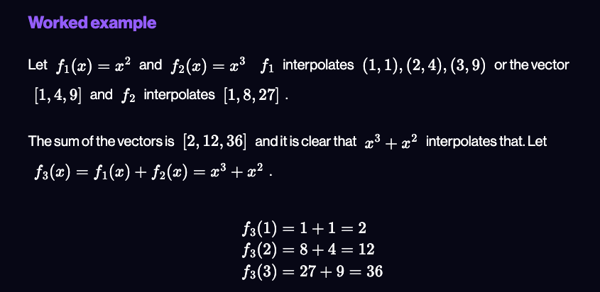

### Testing the math in Python

```python
import galois
import numpy as np

p = 17
GF = galois.GF(p)

xs = GF(np.array([1,2,3]))

# two arbitrary vectors
v1 =  GF(np.array([4,8,2]))
v2 =  GF(np.array([1,6,12]))

def L(v):
    return galois.lagrange_poly(xs, v)

assert L(v1 + v2) == L(v1) + L(v2)
```

## Scalar multiplication

Let $\lambda$ be a scalar (specifically, a field element in finite field). Then

$$ \mathcal{L}(\lambda \mathbf{v}) = \lambda \mathcal{L}(\mathbf{v}) $$

R1CS 검증을 위해 벡터 연산을 다항식으로 바꿀 때, 덧셈뿐 아니라 스칼라 곱도

“벡터에서 먼저 곱하고 보간하나, 보간한 뒤 다항식에 곱하나 결과가 같고"
이를 통해 전체 연산을 한 번의 다항식 연산으로 몰아서 처리할 수 있습니다.

### Worked example

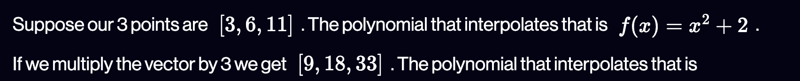

```python
from scipy.interpolate import lagrange

x_values = [1, 2, 3]
y_values = [9, 18, 33]

print(lagrange(x_values, y_values))

#    2
# 3 x + 6
```

### Worked example in code

```python
import galois
import numpy as np

p = 17
GF = galois.GF(p)

xs = GF(np.array([1,2,3]))

# arbitrary vector
v =  GF(np.array([4,8,2]))

# arbitrary constant
lambda_ =  GF(15)

def L(v):
    return galois.lagrange_poly(xs, v)

assert L(lambda_ * v) == lambda_ * L(v)
```

## Scalar multiplication is really vector addition

-   앞에서 본 덧셈·스칼라곱 보존 성질을 좀 더 집약해서 “결국 스칼라곱도 (유한체에서) 반복된 벡터 덧셈으로 볼 수 있고, 벡터 덧셈 그룹과 다항식 덧셈 그룹은 서로 호모모픽하다”는 것입니다.

-   벡터 동등성(모든 원소가 같은지) 검사는 원소별 비교 때문에 𝑂(𝑛) 시간이 듭니다.

-   반면 다항식 동등성(같은 다항식인지) 검사는 Schwartz–Zippel 한 번만 써서 𝑂(1)에 “거의 확실하게” 판단할 수 있습니다.

-   R1CS 검증 문제를 “𝐿𝑎, 𝑅𝑎, 𝑂𝑎” 같은 벡터 동등성 검사에서 “하나의 다항식 동등성 검사”로 바꿔치기 함으로써 전체 제약 만족 여부를 𝑂(𝑛)에서 𝑂(1)로 단축하는 것이 바로 Quadratic Arithmetic Program입니다.

# A Rank 1 Constraint System in Polynomials

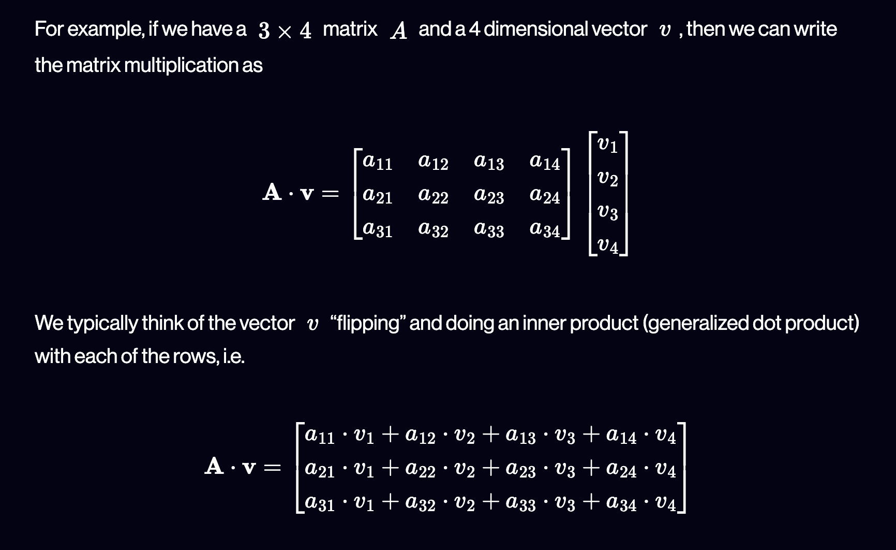
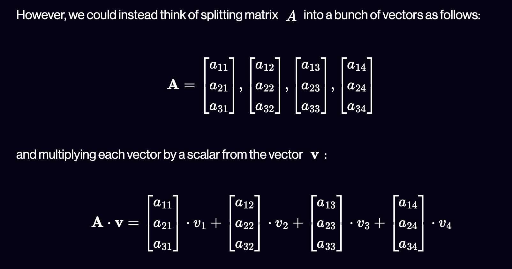

-   벡터 덧셈과 스칼라 곱이 이전에 보인 것처럼
-   Lagrange 보간 → 다항식 덧셈·스칼라곱으로
-   그대로 옮겨지는(호모모픽) 연산이기 때문입니다.

따라서

-   $v_j$ $a(j)$ 각각을 대응하는 다항식에 스칼라 곱으로 치환하고
-   마지막에 네 개 다항식을 더하면
-   원래의 𝐴𝑣 라는 벡터 연산 전체를 단 한 번의 다항식 덧셈·스칼라곱으로 표현할 수 있게 됩니다.

# Succintly testing that $\mathbf{A}\mathbf{v}_1 = \mathbf{B}\mathbf{v}_2$

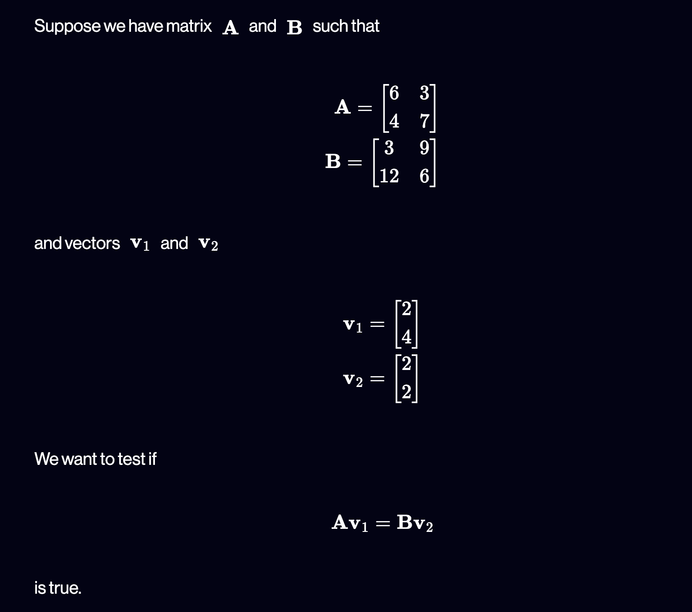
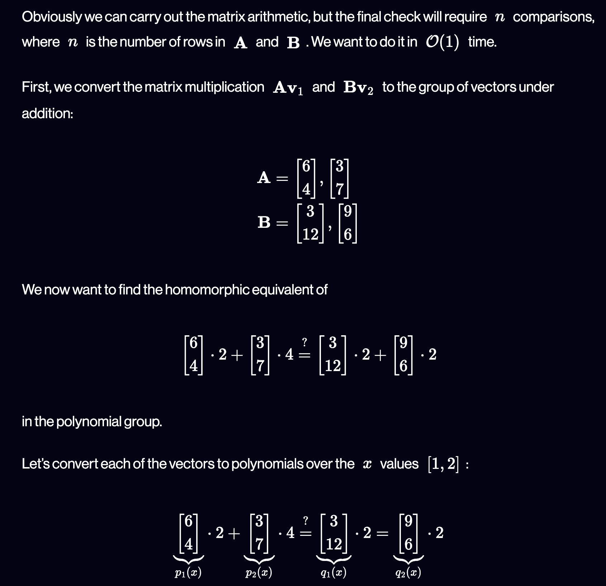

# R1CS to QAP: Succinctly testing that $\mathbf{L}\mathbf{a}\circ\mathbf{R}\mathbf{a}=\mathbf{O}\mathbf{a}$

-   이제 $\mathbf{A}\mathbf{v}_1 = \mathbf{B}\mathbf{v}_2$ 을 succinct 하게 검증할 수 있는것을 알았으니까, $\mathbf{L}\mathbf{a}\circ\mathbf{R}\mathbf{a}=\mathbf{O}\mathbf{a}$ 도 똑같이 검증할 수 있을지 확인해봅시다.

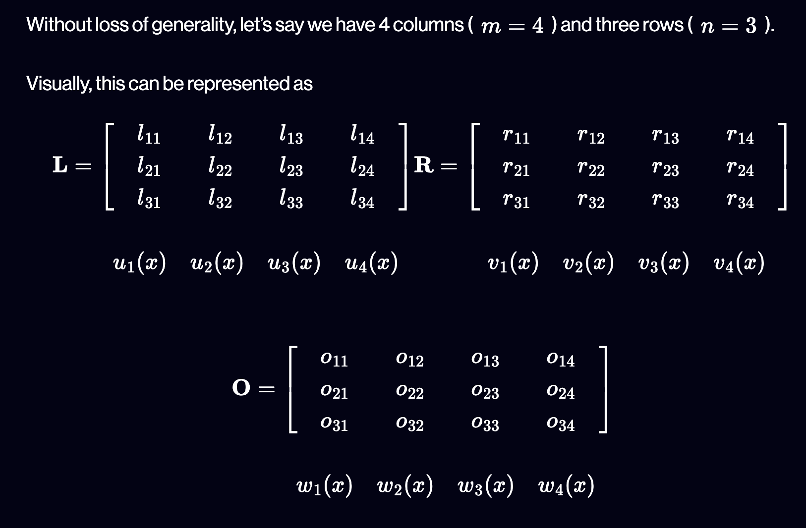
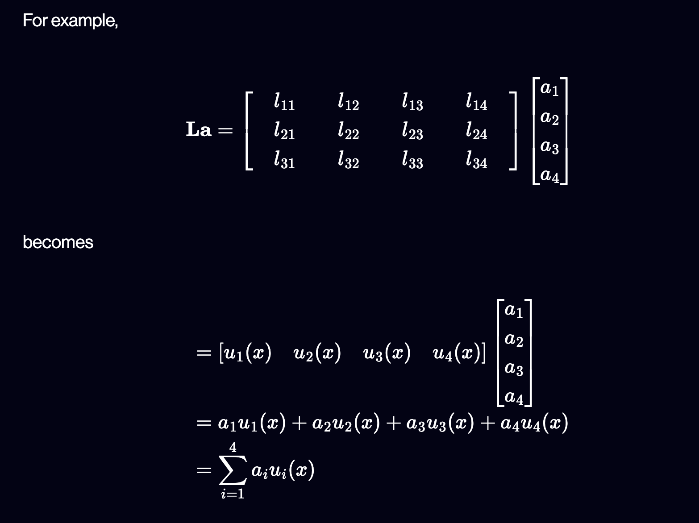
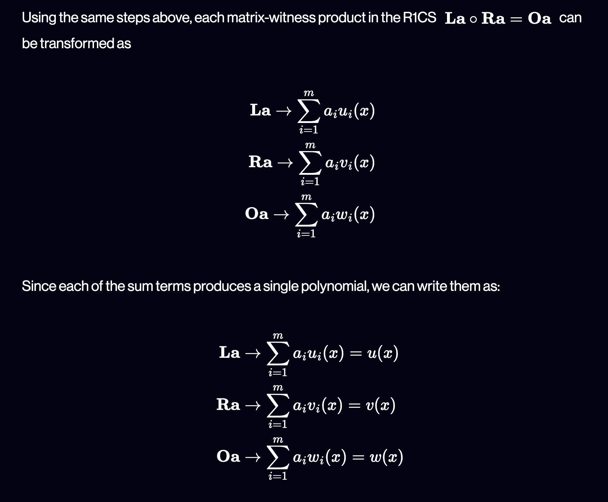

## Why interpolate all the columns?

1. 한꺼번에 𝐿(𝑎)를 보간(interpolate)할 수는 없나요?

-   증명자(Prover)는 자신의 위트니스 𝑎 를 알고 있으니까, 벡터 $La$ 직접 계산한 뒤 Lagrange 보간으로 한 번에 다항식 $u(x) =\mathcal{L}(\mathbf{L}\mathbf{a})$ 을 만들 수 있습니다.

2. 그런데 왜 그렇게 하지 않느냐?

-   바로 “누가” 보간을 해야 하느냐의 문제 때문이에요.
-   **증명자(prover)**는 자기 손에 $a$ 값을 가지고 있으니까 $La$를 직접 계산해서 보간할 수 있습니다.
-   하지만 **검증자(verifier)**나, 나중에 설명할 “trusted setup” 단계에 참여하는 다른 누구도 $a$ 값을 모릅니다.
-   $a$가 비밀(witness)이기 때문에, 이들 입장에서는 $L(a)$ 자체를 다항식으로 미리 만들어 둘 수가 없죠.

3. 그래서 하는 것

-   대신, $L$ 행렬의 각 칼럼(column) $\ell_i$ 에 대해 미리 Lagrange 보간으로 얻은 다항식들

$$ u_i(x) = L(\ell_i)(x) $$

-   을 모두 정의해 둡니다.

-   이 $u_i(x)$ 들은 $a$ 와 무관하므로, 검증자·trusted setup·심지어 오픈한 모두가 “QAP”의 일부로 공통 합의(common reference) 하에 만들 수 있습니다.

4. 검증 단계에서

-   증명자는 자신이 가진 $a = (a_1, \ldots, a_m)$ 값으로

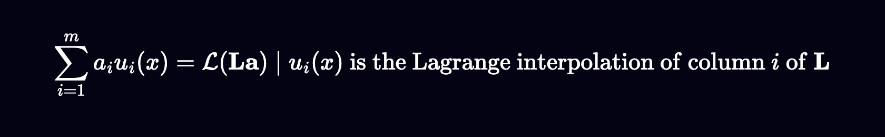

-   을 계산합니다.

-   검증자는 이를 Schwartz–Zippel 테스트로

$$ \mathcal{L}(a) \circ \mathcal{R}(a) = \mathcal{O}(a) $$

-   를 검증할 수 있게 됩니다.

## Polynomial degree imbalance

-   벡터 수준에서는 동일한 Hadamard(원소별) 곱 연산이지만, 이걸 그대로 다항식으로 옮기면 서로 차수가 달라져서 다항식끼리 비교할 수 없습니다.
-   다항식 곱의 차수 불일치
    -   $u(x)v(x)$ 를 실제로 곱해 보면, 두 차수 $(n-1)$ 과 $(n-1)$ 을 더해서 $2n-2$ 짜리 다항식이 됩니다.
    -   그런데 우리가 비교하고 싶은 $w(x)$ 는 $n-1$ 차 다항식입니다.
    -   따라서 $u(x)v(x) = w(x)$ 라고 쓸 수가 없습니다. 두 다항식의 최고차수가 다르기 때문이죠.
-   왜 이런 일이 생기나?
    -   앞서 증명했던 호모모피즘(덧셈과 스칼라곱 보존)은 벡터 덧셈과 스칼라곱에만 적용됩니다.
    -   그러나 여기서 쓰고자 하는 것은 **원소별 곱(Hadamard product)**이고, 이 연산은 다항식 변환이 호모모픽하게 다뤄주지 않습니다.

## Example of underlying equality

-   𝑢(𝑥)는 (1,2), (2,4), (3,8)을 통과하는 2차 다항식
-   𝑣(𝑥)는 (1,4), (2,2), (3,8)을 통과하는 2차 다항식
-   Hadamard product 벡터[8,8,64]를 통과하는 $w(x)$ 역시 2차 다항식

-   하지만, $u(x)v(x)$ 는 실제로 곱해 보면 4차 다항식(2+2 = 4)이고, $w(x)$ 는 2차 다항식이기 때문에,
-   $u(x)v(x) \neq w(x)$
-   다항식 차수가 달라서 당연히 같을 수가 없습니다
-   그럼에도 불구하고, $x = 1, 2, 3$ 에서만 봤을 때,
    -   $u(1)v(1) = 8 = w(1)$
    -   $u(2)v(2) = 8 = w(2)$
    -   $u(3)v(3) = 64 = w(3)$
-   점별로는 완벽히 같죠.

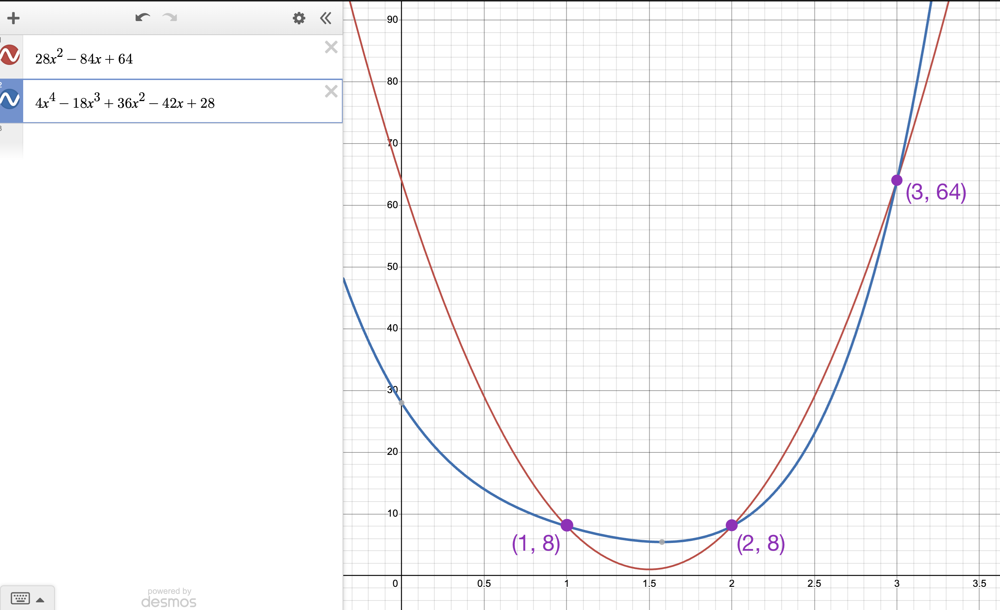

## Interpolating the $\mathbf{0}$ vector

-   그래서 어떻게 검증하느냐?
-   Hadamard 곱으로 생긴 두 다항식 $u(x)v(x)$와 "원소별 곱 벡터"를 보간한 다항식 $w(x)$의 차수가 달라서
-   $u(x)v(x) = w(x)$ 라는 식 자체로는 성립시킬 수 없을 때, 중요한건 어떻게 양변의 차수를 맞추느냐입니다.

1. 원소별 곱 검증 문제

-   우리는 점별로는
-   $u(i)v(i) = w(i)$ for all $i = 1, 2, \ldots, n$
-   라는 “Hadamard 곱 벡터가 같음”을 알고 있어요.
-   그러나 다항식으로 곱해 보면 차수가 다르기 때문에 직접 비교가 불가능합니다.

2. “0 벡터” 보간의 자유도

-   Hadamard 곱 벡터가 정확히 같다면
-   $uv = w + (0, 0, \ldots, 0)$ (0 벡터 추가)
-   “0 벡터”를 Lagrange 보간하면 차수 < n인 영(0) 다항식 $b_{0}(x)$ 이 나옵니다.
-   하지만 차수를 맞추려면, 영이 아닌 더 높은 차수를 갖는 0을 보간해 줄 “잉여 다항식” $b(x)$ 이 필요합니다.

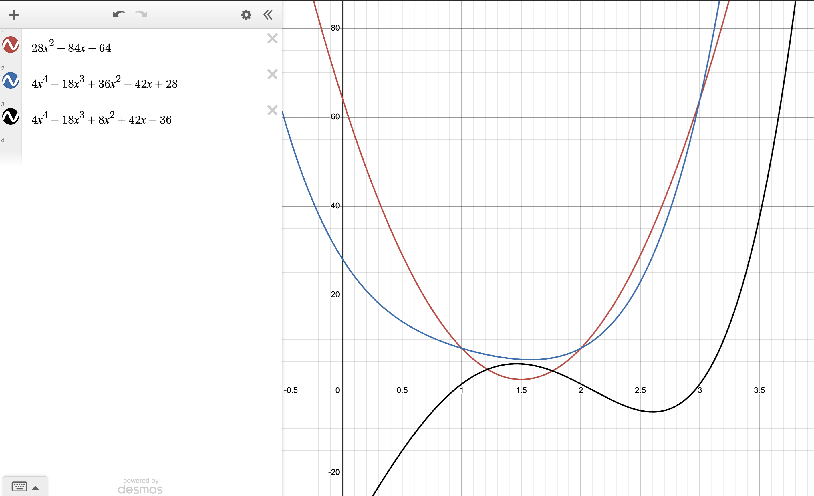

3. 예시

-   슬라이드의 검은 곡선 $b(x)$ 는 4차 (2n-2) 인, (1,0), (2,0), (3,0) 보간 다항식입니다.
-   그러면 $u(x)v(x) = w(x) + b(x)$ 는 양쪽 모두 4차로 “차수 밸런스”가 맞아지죠.

4. 왜 아무 $b(x)$ 나 안 되는가?

-   증명자(prover)가 임의로 $uv - w$ 같은 $b(x)를 골라버리면,
-   그 $b(x)가 실제로 (1,0), (2,0), (3,0) 을 통과하는지(=원소별로 0인지) 증명자만 알 수도 있기 때문에,
-   검증자는 이 $b(x)$가 정말로 0 벡터를 보간했는지 알 수 없습니다.

5. 해결책: vanishing polynomial 제약

-   그래서 우리는 $b(x)$가 반드시 $x = 1, 2, 3, \ldots, n$ 에서 근(root)을 가져야 한다는 조건을 추가합니다.
-   즉, $b(1) = b(2) = b(3) = \ldots = b(n) = 0$ 이어야 합니다.
-   보간 차수는 높되, 이 “뿌리 조건” 덕분에 $b$ 가 점별로 0인 것(=0 벡터)만 허용되죠.

### The union of roots of the polynomial product

-   $h(x) = f(x)g(x)$ 이고, $f$ 와 $g$ 의 근이 각각 $r_1, r_2, \ldots, r_m$ 과 $s_1, s_2, \ldots, s_n$ 이라면,
-   $h$ 의 근은 $r_1, r_2, \ldots, r_m, s_1, s_2, \ldots, s_n$ 이 됩니다.

### Forcing $b(x)$ to be the zero vector

-   vanishing polynomial $t(x)$를 아래와 같이 정의하면,
-   $t(x) = (x-r_1)(x-r_2)\ldots(x-n)$
-   어떤 다항식이든 이 $t(x)$ 로 곱하면, 자동으로 $x = 1, 2, 3, \ldots, n$ 에서 0이 됩니다.
-   따라서, $b(x) = h(x)t(x)$ 처럼 $t(x)$를 인수로 갖도록 강제하고, $h(x)$ 나머지 다항식만 증명자가 선택하도록 만듭니다.
-   $u(x)v(x) = w(x) + h(x)t(x)$
-   이렇게 하면, 차수 밸런스는 좌변과 우변 모두 <= 2n-2 으로 맞춰지고,
-   점별 검증, $t(i) = 0$ 이므로, 우변의 추가 항 $h(i)t(i)$ 는 0이 되어 버립니다.
-   즉,$u(i)v(i) = w(i)$ 이라는 점별 동등성을 보존합니다.
-   증명자는 $h(x) = \frac{u(x)v(x) – w(x)}{t(x)}$ 로 손쉽게$h(x)$를 계산해 제출할 수 있고,
-   검증자는 임의의 한 점 τ를 골라, $u(τ)v(τ) = w(τ) + h(τ)t(τ)$를 확인하면 됩니다.

# QAP End-to-end

-   아래와 같이 행렬 $L$, $R$, $O$ 가 있고, witness vector $\mathbf{a}$ 가 있을 때,
-   $\mathbf{L}\mathbf{a}\circ\mathbf{R}\mathbf{a} = \mathbf{O}\mathbf{a}$
-   행렬들은 n개의 열과 m개의 행으로 이루어져 있고, n = 3, m = 4 라고 합시다.
    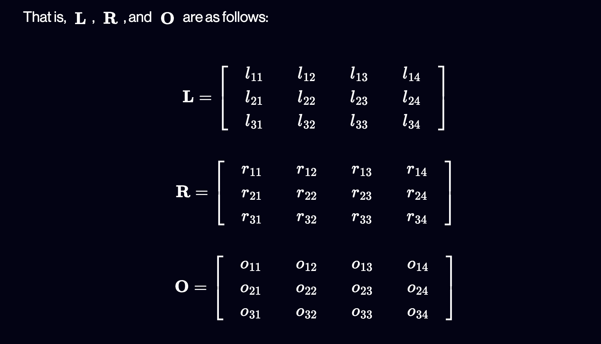
    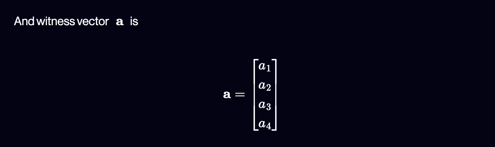
    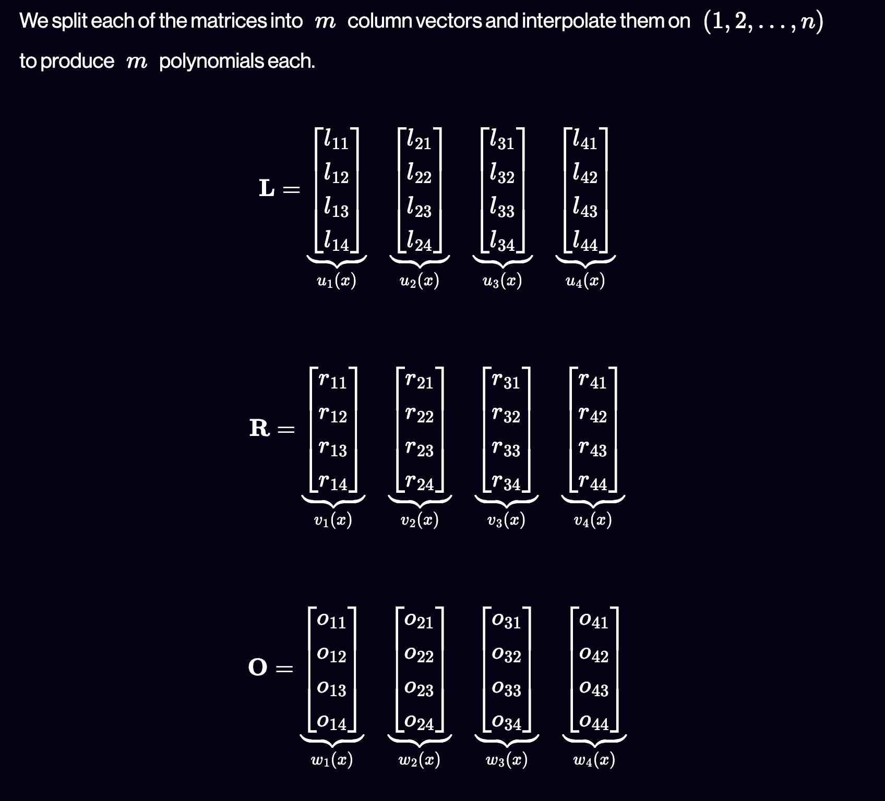
    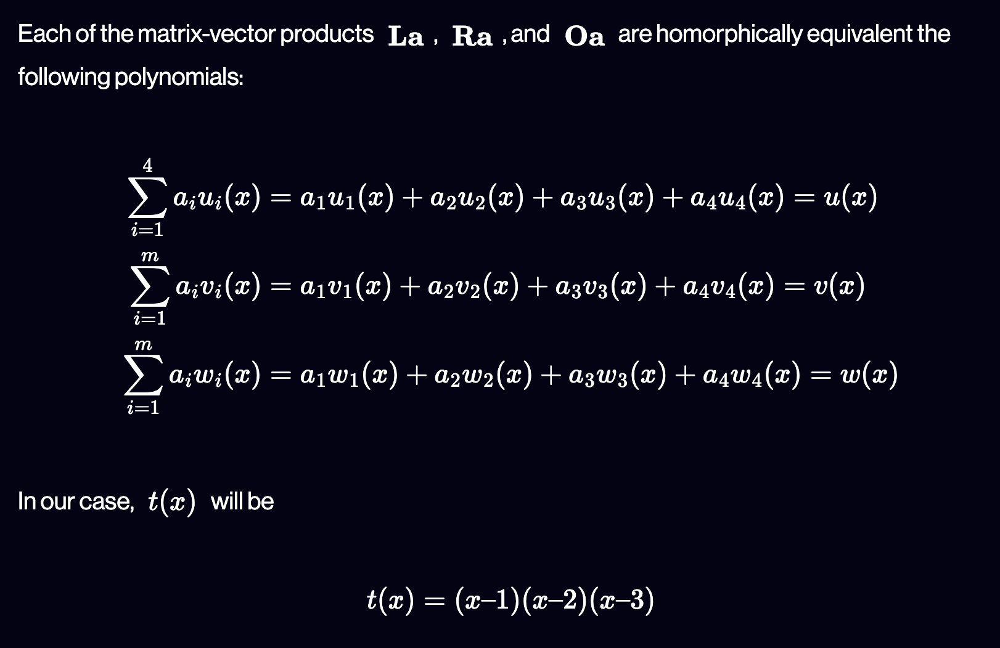
    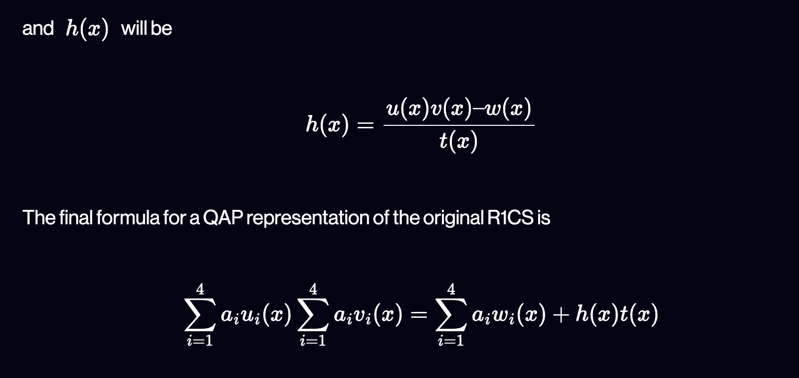

# Final formula for a QAP

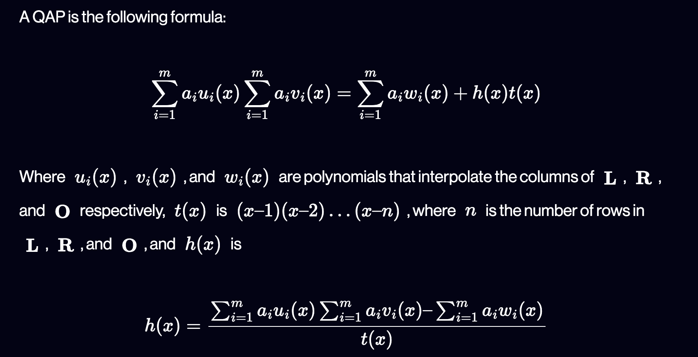

# Succinct zero knowledge proofs with Quadratic Arithmetic Programs

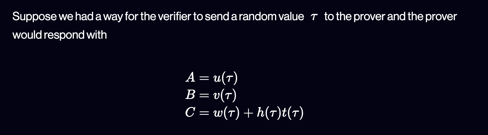

-   The verifier could check that $AB = C$ and accept that the prover has a valid witness that satisfies both the R1CS and the QAP.
-   However, this would require the verifier to trust that the prover is evaluating the polynomials correctly, and we don’t have a mechanism to force the prover to do so.

# 왜 Quadratic Arithmetic Program인가?

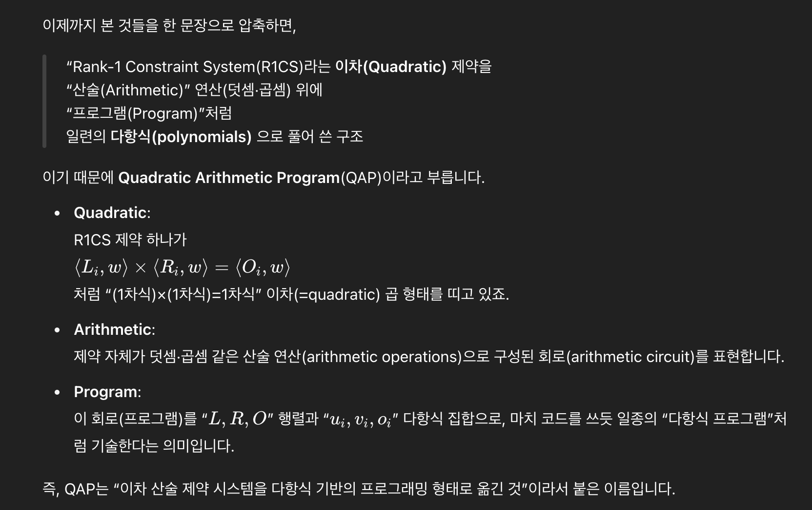
